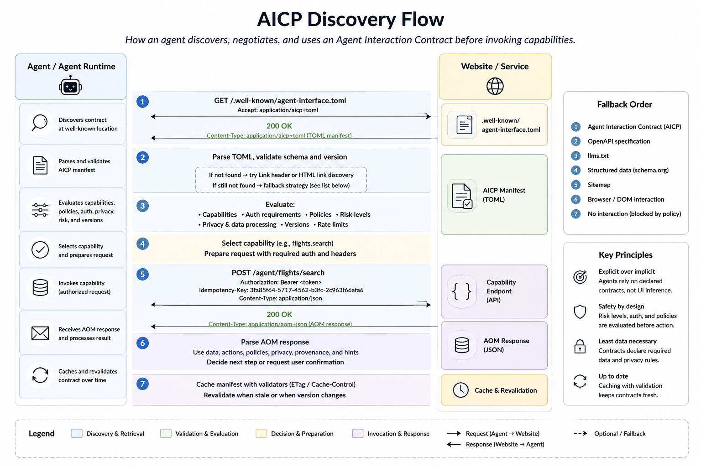
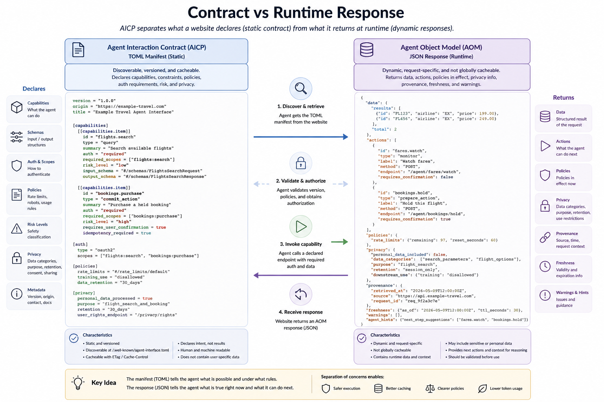
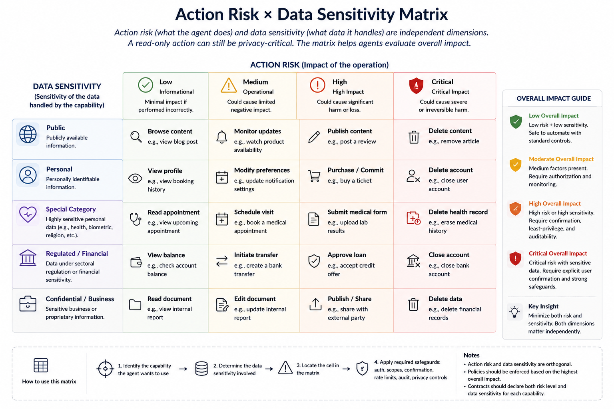
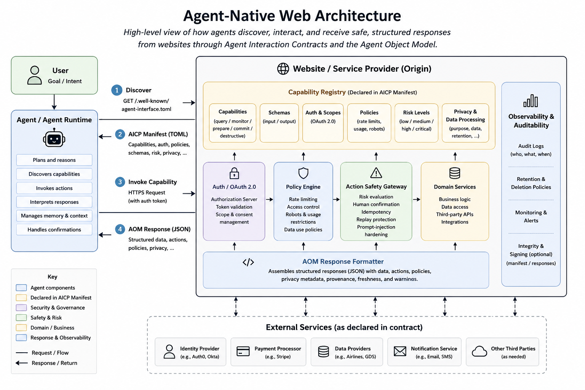
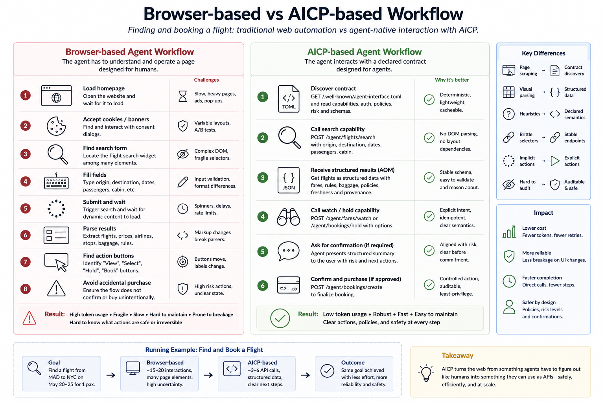

# The Agent-Native Web: Declarative Interaction Contracts for AI Agents over HTTP

## A Matter of Interfaces: Toward an Agent-Native Layer for the Web

---

title: "The Agent-Native Web: Declarative Interaction Contracts for AI Agents over HTTP"
subtitle: "A Matter of Interfaces: Toward an Agent-Native Layer for the Web"
author: "Sergio Muñoz Gamarra"
version: "0.1"
date: "2026-05-09"
canonical_url: "https://sergiomunozgamarra.github.io/iacp"
license: "CC BY-NC-ND 4.0"

---

> © 2026 Sergio Muñoz Gamarra. This work is licensed under CC BY-NC-ND 4.0.  

> You may share it with attribution for non-commercial purposes, but you may not modify it or use it commercially without explicit written permission.


### Abstract

The web is changing. Not because HTTP is obsolete, and not because human browsing will disappear, but because a new kind of user is here: the AI agent. We are moving toward the idea of an “agent for everything”: a system that can search, compare, plan, book, buy, monitor, fill forms, and execute workflows on behalf of people and organizations. The promise is strong, but current web interfaces make reliable execution hard. Most websites are still designed for humans looking at screens, not for agents that need clear capabilities, constraints, permissions, and consequences.

Today, many agents must act like humans inside a browser. They click buttons, inspect pages, parse DOM structures, process screenshots, handle cookie banners, wait for JavaScript, and recover from UI changes. This can work, but it is costly and brittle: it increases token usage, adds latency, depends on unstable layouts, and blurs security boundaries. Recent web-agent benchmarks also show that many online tasks remain difficult, and that API-based or hybrid approaches often outperform pure browsing agents in realistic settings.

This paper argues that what is missing is not a replacement for HTTP, but an agent-native layer on top of HTTP. Websites should be able to declare, in a standard machine-readable way, what agents can read, query, compare, prepare, and execute safely. To do this, we propose Agent Interaction Contracts: declarative HTTP-native manifests that expose capabilities, input and output schemas, authentication requirements, authorization scopes, rate limits, usage policies, action risk levels, provenance metadata, and human-confirmation requirements. Because agents may operate over personal, sensitive, or regulated data, these contracts should also expose privacy-relevant metadata such as data categories, processing purpose, consent requirements, retention, downstream-use restrictions, and third-party sharing.

Agent Interaction Contracts are meant to complement, not replace, existing standards such as OpenAPI, robots.txt, llms.txt, OAuth, and the Model Context Protocol. OpenAPI describes APIs, robots.txt expresses crawler preferences, llms.txt helps models consume content, OAuth supports delegated authorization, and MCP connects models with tools. But none of them alone provides a lightweight, website-level contract for agentic interaction.

We present the motivation, design principles, discovery mechanism, capability taxonomy, security model, and response structure of this layer. We also outline an evaluation methodology that compares agent-native contracts with browser-based and API-based approaches in terms of token cost, task success, latency, interaction steps, and unsafe-action rate. Our central claim is simple: the “agent for everything” will not be achieved only by making agents better at using human interfaces. We must also make the web itself more explicit, auditable, and ready for machine-mediated interaction.

## Terminology

| Term | Meaning |
|---|---|
| AICP | The proposed protocol/convention for declaring agent-facing website contracts |
| Agent Interaction Contract | The manifest exposed by a website to describe capabilities, policies, risks, and privacy metadata |
| AOM | Agent Object Model, the runtime response structure for agent-facing capability calls |
| Capability | An agent-facing operation exposed by a website |
| Agent runtime | The system that interprets contracts, plans actions, and invokes capabilities |
| Agent browser | A user agent for AI systems that manages discovery, credentials, permissions, confirmations, and fallback browsing |

## 1. Introduction

The web was built for human browsing. HTTP gives us a common way to exchange resources, and browsers give us a universal interface to consume them. This model has been extremely successful. But now a new user is emerging: the AI agent.

AI agents are expected to search, compare, monitor, plan, fill forms, book, buy, and execute workflows across websites on behalf of users. This is the promise of the “agent for everything”. In practice, that promise is still hard to deliver reliably, because most websites expose human-facing pages rather than agent-facing capabilities.

As a result, many agents must behave like humans inside a browser. They inspect HTML, parse DOM structures, process screenshots, click buttons, wait for JavaScript, handle cookie banners, and recover from UI changes. This can work, but it is expensive and fragile. It increases token consumption, latency, implementation complexity, and security risk.

There is also a scaling issue: token budgets are not infinite. Cost, availability, and latency are becoming strategic constraints for production systems. Reducing unnecessary token use is no longer just optimization; it is becoming a core requirement for scalable agentic infrastructure.

The problem is not HTTP itself. HTTP already provides extensible semantics through methods, headers, status codes, representations, and URI-based resources. The problem is that websites rarely publish explicit machine-readable contracts describing what agents can safely read, query, compare, prepare, or execute.

This paper proposes Agent Interaction Contracts: declarative, HTTP-native manifests through which websites expose capabilities, input and output schemas, authentication requirements, authorization scopes, rate limits, usage policies, action risk levels, provenance metadata, privacy metadata, and human-confirmation requirements.

The proposal complements existing standards such as OpenAPI, robots.txt, llms.txt, OAuth, and MCP. OpenAPI describes APIs, robots.txt expresses crawler preferences, llms.txt helps models consume content, OAuth enables delegated authorization, and MCP connects models with tools. Agent Interaction Contracts target a different gap: a lightweight, website-level contract for agentic interaction.

The key idea is straightforward: agents should not need to infer a website's capabilities from visual interfaces when the website can declare them explicitly.

This paper makes four contributions. First, it defines the interface mismatch between human-oriented browsing and agent-oriented interaction. Second, it introduces Agent Interaction Contracts as an HTTP-native abstraction for exposing website capabilities. Third, it proposes a capability taxonomy and a security model for agentic web actions. Fourth, it outlines an evaluation methodology comparing this approach with browser-based and API-based agents across token cost, task success, latency, interaction steps, and unsafe-action rate.

The web does not need to stop being human-readable. But it must become agent-readable as well.

## 2. Background and Related Work

The need for an agent-native web interface does not appear in isolation. The web already has several mechanisms for machine-readable access, API description, authorization, structured data, and tool integration. The problem is that these mechanisms solve adjacent problems, but not exactly the problem of safe and efficient agentic interaction with ordinary websites.

### 2.1 HTTP as the substrate

HTTP should not be replaced in order to support AI agents. It already provides a flexible model based on resources, methods, headers, status codes, representations, caching, and content negotiation. This makes HTTP a good substrate for an agent-native layer.

The issue is not the transport protocol. The issue is the lack of explicit interaction contracts. Most websites expose pages and visual workflows, but they do not declare, in a standard way, which capabilities are available to agents, how these capabilities should be invoked, what permissions are required, or what consequences an action may have.

### 2.2 Existing machine-readable web mechanisms

The web already contains several partial solutions.

- **OpenAPI** describes HTTP APIs in a structured way. It is useful for developers and can also help agents understand endpoints. However, OpenAPI is not normally exposed as a universal website-level agent interface, and it does not focus on usage policies, action risk, human confirmation, provenance, or agent-specific discovery.

- **robots.txt** expresses crawler preferences. It is simple and widely understood, but it is not an authorization system and it does not describe capabilities. It can tell a crawler where it should not go, but it cannot tell an agent how to safely search flights, compare products, or prepare a booking.

- **sitemaps** help machines discover URLs. They are useful for indexing, but they describe locations, not interactions.

- **schema.org** and structured data help websites describe entities such as products, articles, organizations, events, and reviews. This is valuable, but it is mainly about the meaning of content, not about how an agent should execute workflows or respect action boundaries.

- **llms.txt** is an emerging convention to make website content easier for language models to consume. It is important because it recognizes that LLMs need more direct access to relevant information. However, it is mostly content-oriented. It does not define transactional actions, authentication scopes, rate limits, risk levels, or confirmation requirements.

### 2.3 APIs and the limits of API-first interaction

A common answer to this problem is: agents should just use APIs. In many cases, this is true. APIs are more stable and efficient than browser automation. But as a general answer for the public web, this is not enough. Many APIs are private, undocumented, inconsistent, partner-only, or disconnected from the public website experience. Also, APIs are designed mainly for developers, not necessarily for autonomous agents acting on behalf of users.

An agent does not only need to know that an endpoint exists. It also needs to know what the endpoint means in a user workflow, whether the action is reversible, what permissions are required, what rate limits apply, whether the result can be reused, and whether human confirmation is required before continuing. This is why an agent-native layer should not be only an API description. It should be an interaction contract.

### 2.4 Model Context Protocol

The Model Context Protocol addresses an important part of the agent ecosystem: connecting models with tools, data sources, and external systems. It is useful for controlled environments, enterprise integrations, development tools, databases, and custom workflows.

However, MCP is tool-centric. A public website is resource-centric. Requiring every website to create, deploy, and maintain a custom MCP server may be too heavy as a universal web mechanism. In many cases, a website should be able to expose agent-consumable capabilities directly over HTTP, using the backend and routes it already has.

In this sense, Agent Interaction Contracts are not a replacement for MCP. They are complementary. MCP can connect agents to tools. Agent Interaction Contracts can help ordinary websites describe themselves as safe, discoverable, policy-aware interaction surfaces.

### 2.5 Authorization and delegated access

Agentic web interaction also needs a clear authorization model. When an agent acts on behalf of a user, the website must know what the user has delegated, what the agent is allowed to do, and where the boundary is between reading, preparing, and committing an action.

OAuth already provides a strong foundation for delegated authorization. But OAuth alone does not describe the semantics of agentic actions. It can say that a token has a scope, but it does not define a common taxonomy for low-risk queries, medium-risk preparatory actions, high-risk purchases, or destructive operations.

For this reason, an agent-native contract should build on existing authorization systems, not replace them. It should make permissions more understandable for agents and users by connecting scopes with declared capabilities and risk levels.

### 2.6 Web agents and browser automation

Recent AI systems show that agents can operate graphical interfaces. This is impressive and useful, especially when no better interface exists. But using a browser as the default machine interface is not ideal.

Browser automation forces agents to infer intent from presentation. It also makes them vulnerable to interface changes, hidden state, misleading content, modals, CAPTCHAs, dynamic JavaScript, and prompt injection attacks embedded in webpages.

This does not mean browser agents are useless. They are necessary as a fallback. But fallback should not become the main architecture of the agentic web.

### 2.7 The missing layer

Each existing mechanism solves one part of the problem:

| Mechanism | Main purpose | Main limitation for agents |
|---|---|---|
| HTTP | Resource exchange | Does not declare agent capabilities |
| OpenAPI | API description | Not a full agent interaction contract |
| robots.txt | Crawler preferences | Not authorization; no actions |
| sitemap | URL discovery | No workflow semantics |
| schema.org | Structured entities | No interaction model |
| llms.txt | LLM-readable content | Mostly content-oriented |
| OAuth | Delegated authorization | No action taxonomy |
| MCP | Tool integration | May be too heavy per website |
| Browser automation | Universal fallback | Expensive and fragile |

The gap is therefore clear. The web has pages for humans, APIs for developers, and tool protocols for controlled integrations. But it does not yet have a lightweight, standard, website-level contract for AI agents.

This is the gap that Agent Interaction Contracts aim to fill.

## 3. Problem Statement

AI agents are starting to use the web as an operational environment. They do not only retrieve documents. They compare alternatives, monitor changes, fill forms, prepare actions, and sometimes execute workflows on behalf of users. However, the current web does not expose a clear interaction model for this kind of use.

The result is a mismatch between what websites provide and what agents need.

### 3.1 Human-facing pages are inefficient agent interfaces

Most websites are designed to guide human attention. They use layout, hierarchy, color, buttons, menus, modals, animations, pagination, filters, and progressive disclosure. These elements are useful for people, but they are not the most efficient interface for agents.

An agent does not primarily need visual presentation. It needs to know:

* what capabilities exist;
* what inputs are required;
* what outputs will be returned;
* what constraints apply;
* what permissions are needed;
* what actions are safe;
* what actions have real-world consequences.

When this information is not declared explicitly, the agent has to infer it from the page. This inference is expensive, fragile, and sometimes wrong.

### 3.2 Browser automation is a costly fallback

Browser automation is powerful because it works even when no API or machine-readable interface exists. But it should be understood as a fallback, not as the ideal architecture.

A browser-based agent must often:

* inspect HTML and DOM structures;
* process screenshots or accessibility trees;
* wait for JavaScript execution;
* handle cookie banners and modals;
* fill forms designed for humans;
* distinguish navigation from content;
* recover from layout changes;
* avoid accidental clicks on high-impact actions.

This consumes tokens, time, and engineering effort. It also introduces operational fragility: a small UI change can break an agentic workflow.

### 3.3 Token consumption is becoming a strategic constraint

The cost of agentic browsing is not only technical. It is also economic.

As AI systems become more common, token consumption becomes a scarce resource. Models are more capable, but agentic workflows can require long context windows, repeated observations, intermediate reasoning, tool calls, retries, and safety checks. In practice, this creates a form of token rationing: systems must decide where tokens are really necessary and where they are being wasted.

Using tokens to parse irrelevant markup, visual structure, duplicated navigation, cookie text, advertisements, and unstable page elements is not sustainable at scale. For this reason, token efficiency is not just an optimization. It is a requirement for scalable agentic systems.

An agent-native interface should reduce the amount of unnecessary context that agents need to process. Instead of reading a full page to infer that a flight search capability exists, the agent should be able to discover the capability directly.

### 3.4 HTML is not a capability contract

HTML is excellent for presenting documents and interfaces. It can expose links, forms, labels, metadata, and structured elements. But HTML does not reliably express the business-level semantics that agents need.

For example, a page may contain several buttons:

* “Search”
* “Continue”
* “Reserve”
* “Pay now”
* “Cancel”
* “Confirm”

A human can usually understand the difference from context. An agent may need to infer whether a button is low-risk, reversible, financially binding, destructive, or merely navigational.

This is not only a usability problem. It is a safety problem.

A website should be able to declare that one operation is a read-only query, another is a preparatory action, another requires explicit user confirmation, and another is a high-risk irreversible action. These semantics should not depend only on visual interpretation.

### 3.5 Site-specific APIs are not enough

APIs are a better interface for agents than visual pages, but they do not solve the problem completely.

Many APIs are:

* private;
* undocumented;
* unstable;
* partner-only;
* inconsistent across providers;
* disconnected from the public website experience;
* not designed for delegated agentic use.

Even when an API exists, the agent still needs to understand how endpoints map to user intentions and real-world consequences. A normal API description may explain parameters and responses, but it may not declare risk level, confirmation requirements, usage policies, provenance, freshness, or safe fallback behavior.

The problem is therefore not only access to endpoints. The problem is the lack of an interaction contract.

### 3.6 Security boundaries are unclear

When an agent browses a website like a human, the boundary between reading, preparing, and executing can become ambiguous.

This creates several risks:

* the agent may click a high-impact button without understanding the consequence;
* the page may contain malicious or misleading instructions;
* the user may delegate too much authority;
* the website may not know whether the action is human-driven or agent-driven;
* the agent runtime may not know which actions require confirmation;
* auditability becomes difficult.

Agentic systems need explicit safety boundaries. A read-only query, a reversible preparatory action, a financial transaction, and a destructive operation should not be treated as equivalent interactions.

### 3.7 The problem in one sentence

The current web forces AI agents to infer capabilities, constraints, permissions, and risks from interfaces designed for humans.

This paper argues that this inference should become explicit.

Websites should declare their agent-facing capabilities through standard, machine-readable, HTTP-native interaction contracts.

## 4. Design Goals

Agent Interaction Contracts should not try to reinvent the web. They should add a missing layer to the web that already exists. For this reason, the proposal must be simple enough to be adopted by ordinary websites, but expressive enough to support real agentic workflows.

### 4.1 HTTP-native

The proposal should be built on top of HTTP, not as a replacement for it.

HTTP already provides resources, methods, headers, status codes, representations, caching, authentication mechanisms, and content negotiation. Agent Interaction Contracts should use these existing mechanisms instead of creating a parallel transport system.

The goal is not a new internet for agents. The goal is an agent-readable layer for the current internet.

### 4.2 Discoverable

An agent should be able to discover whether a website exposes an agent-native interface without guessing, scraping, or relying on external registries.

A simple discovery mechanism could be:

```http
GET /.well-known/agent-interface
```

or an HTTP `Link` header:

```http
Link: </.well-known/agent-interface>; rel="agent-interface"
```

The important point is that discovery must be predictable. If every website exposes its agent interface in a different place, the standard loses much of its value.

### 4.3 Declarative

Websites should declare capabilities explicitly.

An agent should not need to inspect a visual page to infer that a website supports flight search, product comparison, booking holds, subscription cancellation, invoice download, or support ticket creation.

The contract should describe:

* what capabilities exist;
* how they are invoked;
* what inputs are required;
* what outputs are returned;
* what permissions are needed;
* what policies apply;
* what risks are involved.

### 4.4 Token-efficient

The contract should reduce unnecessary token consumption.

Agents should not spend tokens parsing navigation menus, advertisements, cookie banners, duplicated layout, visual instructions, or irrelevant markup when the task only requires a small set of structured capabilities and results.

Token efficiency is important for cost, latency, scalability, and reliability. As agentic systems become more common, token usage will become a design constraint, not only a billing detail.

### 4.5 Secure by default

The protocol must treat security as a first-class design goal.

Agentic interaction is different from passive crawling. Agents may act on behalf of users, operate across services, and execute workflows with financial, legal, operational, or privacy consequences.

For this reason, contracts should support:

* authentication requirements;
* authorization scopes;
* action risk levels;
* human-confirmation requirements;
* rate limits;
* auditability;
* idempotency for high-impact actions;
* protection against prompt injection and misleading instructions.

Security cannot be an optional appendix. It must be part of the contract.

### 4.6 Policy-aware

Websites need control over how agents consume and use their resources.

A contract should express policies such as:

* whether anonymous access is allowed;
* whether commercial use is allowed;
* whether citation is required;
* whether content can be summarized;
* whether content can be used for training;
* what rate limits apply;
* what pricing or quota model exists.

This is important because agentic access should not become a more sophisticated form of uncontrolled scraping. The standard should give websites a way to support agents while preserving control over usage.

### 4.7 Action-aware

Reading is not the same as acting.

An agent interface must distinguish between different kinds of interactions:

* read-only queries;
* comparisons;
* monitoring;
* preparatory actions;
* commit actions;
* destructive actions.

A flight search is not the same as buying a ticket. Preparing a booking hold is not the same as confirming payment. Downloading an invoice is not the same as cancelling an account.

The contract should make these differences explicit, because agents and users need to know when an action is safe, reversible, risky, or final.

### 4.8 Backward compatible

Agent Interaction Contracts should coexist with the current web.

Human-facing pages should continue to work. Existing APIs should continue to work. OpenAPI, robots.txt, sitemaps, structured data, OAuth, llms.txt, and MCP should remain useful.

The purpose is not to replace all previous mechanisms, but to connect them into a clearer agent-facing layer.

### 4.9 Easy to adopt

If adoption requires a large engineering project, most websites will not implement it.

The standard should be easy to generate from existing backend structures:

* routes;
* schemas;
* permissions;
* OpenAPI definitions;
* authentication scopes;
* rate limit rules;
* business actions.

Frameworks should be able to expose a first version automatically, and developers should be able to refine it manually where needed.

### 4.10 Auditable

Agentic interactions should be traceable.

When an agent performs a task, it should be possible to understand:

* which capability was used;
* under which authorization scope;
* with which input;
* what output was returned;
* what policy applied;
* whether user confirmation was required;
* whether the action had real-world consequences.

This matters for debugging, compliance, accountability, and user trust.

### 4.11 Minimal but extensible

The first version should be small.

A standard that tries to solve every possible interaction from the beginning will probably fail. The first version should define only the essential elements: discovery, capabilities, schemas, policies, authentication, risk levels, and provenance.

At the same time, it should be extensible enough to support more advanced use cases later, such as subscriptions, events, payments, negotiation, reputation, pricing, and agent identity.

The design principle is simple: start minimal, but do not close the door to the real web.

### 4.12 Privacy-preserving

Agent Interaction Contracts should support privacy-preserving interaction by design.

Agents should not receive more personal data than necessary to complete a task. A contract should declare which data categories are required, which are optional, which are forbidden, why the data is needed, how long it may be retained, and whether it may be shared with third parties.

This is important because agentic workflows may involve personal accounts, payments, invoices, health portals, employment systems, travel documents, banking systems, and other sensitive contexts. Token efficiency and privacy are connected: the less irrelevant context an agent needs to process, the less unnecessary personal data enters the agent runtime.

## 5. Agent Interaction Contracts

An Agent Interaction Contract is the core element of the proposed agent-native web layer. It is a machine-readable declaration, exposed by a website over HTTP, that describes how AI agents can interact with the site in a safe, efficient, and policy-aware way.

The purpose of the contract is not only to describe endpoints. It is to describe interaction. An agent should be able to understand what the website allows, what it requires, what it returns, what it forbids, and which actions may have real consequences.

### 5.1 Definition

An **Agent Interaction Contract** can be defined as:

> A machine-readable declaration, exposed over HTTP, that describes the capabilities a website makes available to AI agents, including how to invoke them, what inputs and outputs they accept, what policies govern their use, what authentication is required, what risks actions carry, and how results should be attributed.

This definition is intentionally broader than a traditional API description. APIs describe how to call endpoints. Agent Interaction Contracts describe how an agent can participate in a website workflow.

In this sense, the contract is not only technical. It is also operational and semantic.

### 5.2 Core components

A contract should include the minimum information required for an agent to interact with a website without guessing from the visual interface.

At minimum, it should describe:

- site metadata;
- supported contract version;
- available capabilities;
- input and output schemas;
- authentication requirements;
- authorization scopes;
- rate limits;
- usage policies;
- action risk levels;
- human-confirmation requirements;
- provenance and attribution rules;
- privacy and data-processing metadata.

### 5.3 Canonical representation

The reference representation of an Agent Interaction Contract should be a manifest format, not only a data exchange format. For this reason, this paper proposes **TOML** as the canonical representation for static contract files.

TOML is appropriate because Agent Interaction Contracts are closer to configuration manifests than to transactional API payloads. They are intended to be read by machines, but also reviewed, edited, versioned, and discussed by developers. Compared with YAML, TOML is more constrained and less ambiguous. Compared with JSON, it is easier to read and maintain manually.

A website may expose the contract at:

```http
GET /.well-known/agent-interface.toml
```

or through content negotiation:

```http
Accept: application/aicp+toml
```

JSON should still be supported as an equivalent representation for clients and systems that prefer strict machine-oriented parsing:

```http
Accept: application/aicp+json
```

In this model, TOML is recommended for static manifests, while JSON remains the preferred format for runtime request and response payloads.

A simple contract could look like this:

```toml
aicp_version = "0.1"

[site]
name = "Example Travel"
origin = "https://example-travel.com"

[policies]
citation_required = true
commercial_use = "requires_auth"
training_use = "disallowed"

[data_processing]
personal_data_processed = false
purpose = "capability_discovery"
data_minimization_required = true
retention = "not_applicable"

[rate_limits]
anonymous = "20/hour"
authenticated = "1000/hour"

[[capabilities]]
id = "flights.search"
type = "query"
method = "POST"
endpoint = "/agent/flights/search"
risk_level = "low"
auth = "optional"
input_schema = "#/schemas/FlightSearchRequest"
output_schema = "#/schemas/FlightSearchResponse"

[[capabilities]]
id = "bookings.hold"
type = "prepare_action"
method = "POST"
endpoint = "/agent/bookings/hold"
risk_level = "medium"
auth = "required"
required_scopes = ["bookings:write"]
requires_user_confirmation = true

[[capabilities]]
id = "bookings.purchase"
type = "commit_action"
method = "POST"
endpoint = "/agent/bookings/purchase"
risk_level = "high"
auth = "required"
required_scopes = ["bookings:purchase"]
requires_user_confirmation = true
idempotency_required = true
data_sensitivity = "personal"

[capabilities.privacy]
personal_data_required = ["full_name", "email", "payment_token"]
purpose = "ticket_purchase"
requires_explicit_consent = true
retention = "legal_requirement"
```

This example is small, but it already gives the agent more useful information than a visual page. The agent does not need to infer that flight search is a low-risk query, that purchase is a high-risk action, or that confirmation is required. The website declares it.

### 5.4 Capabilities

A capability is an operation or resource that the website exposes to agents.

Capabilities should be described at the level of user intention, not only at the level of technical endpoints. For example, `flights.search` is more meaningful to an agent than `/api/v3/search`.

A capability should normally include:

- a stable identifier;
- a type;
- a human-readable description;
- the HTTP method and endpoint;
- input and output schemas;
- authentication requirements;
- required authorization scopes;
- rate limits;
- risk level;
- confirmation requirements;
- freshness or caching rules;
- provenance rules.

Example:

```toml
[[capabilities]]
id = "products.compare"
type = "compare"
description = "Compare products by price, availability, delivery time, and return policy."
method = "POST"
endpoint = "/agent/products/compare"
risk_level = "low"
auth = "optional"
input_schema = "#/schemas/ProductCompareRequest"
output_schema = "#/schemas/ProductCompareResponse"
cache_ttl_seconds = 300
```

This makes the website more legible for agents. It also gives the website owner a clear place to define what is supported and what is not.

### 5.5 Capability taxonomy

Not all capabilities are the same. A contract should distinguish between passive access, reversible actions, and high-impact operations.

A proposed initial taxonomy is:

| Type | Meaning | Example |
|---|---|---|
| `resource` | A readable object or collection | Product, article, invoice |
| `query` | A parameterized information request | Search flights |
| `compare` | A structured comparison operation | Compare fares |
| `monitor` | A recurring or event-based observation | Watch price changes |
| `prepare_action` | A reversible or non-final action | Create booking hold |
| `commit_action` | An action with real-world effect | Purchase ticket |
| `destructive_action` | A destructive or hard-to-reverse action | Cancel subscription |
| `event` | A subscribable change | Price dropped |
| `policy` | A rule governing use | Citation required |

This taxonomy is important because agents need to reason about action boundaries. A query can usually be executed without user confirmation. A purchase should not.

### 5.6 Risk levels

Every capability should be associated with a risk level.

A simple initial model could be:

| Risk level | Meaning | Example |
|---|---|---|
| `low` | Read-only or informational | Search products |
| `medium` | Reversible or preparatory | Hold a booking |
| `high` | Financial, legal, or operational effect | Buy a ticket |
| `critical` | Destructive, sensitive, or hard to reverse | Cancel an account |

Risk levels are not only useful for agents. They are also useful for users, developers, auditors, and website owners.

For example:

```toml
[[capabilities]]
id = "account.cancel"
type = "destructive_action"
method = "POST"
endpoint = "/agent/account/cancel"
risk_level = "critical"
requires_user_confirmation = true
requires_strong_authentication = true
```

The contract makes clear that this is not a normal request. It is an action with serious consequences.

### 5.7 Data sensitivity

Action risk and data sensitivity should be treated as different dimensions.

A read-only capability can still expose sensitive data. For example, downloading a medical record or an invoice may be low risk from an action perspective, but high risk from a privacy perspective. For this reason, a contract should be able to declare both the operational risk of a capability and the sensitivity of the data it processes.

A simple initial model could be:

| Data sensitivity | Meaning | Example |
|---|---|---|
| `public` | Public information | Product catalog |
| `personal` | Identifiable personal data | Name, email, booking history |
| `confidential` | Sensitive account or business data | Invoices, contracts |
| `special_category` | Highly sensitive personal data | Health, biometrics, religion |
| `regulated` | Data under sectoral regulation | Banking, insurance, healthcare |

Example:

```toml
[[capabilities]]
id = "medical.records.download"
type = "resource"
method = "GET"
endpoint = "/agent/medical-records/{record_id}"
risk_level = "low"
data_sensitivity = "special_category"
auth = "required"
required_scopes = ["medical_records:read"]
requires_user_confirmation = true

[capabilities.privacy]
purpose = "display_medical_record_to_user"
requires_explicit_consent = true
data_minimization = true
retention = "session_only"
```

The important principle is simple: a capability can be read-only and still be privacy-critical.

### 5.8 Policies

A contract should allow websites to express usage policies directly.

Policies may include:

- whether anonymous access is allowed;
- whether commercial use is allowed;
- whether citation is required;
- whether content can be summarized;
- whether content can be used for model training;
- whether results can be cached;
- whether automated monitoring is allowed;
- what rate limits apply;
- what pricing model exists.

Example:

```toml
[policies]
anonymous_access = true
commercial_use = "requires_auth"
citation_required = true
summarization = "allowed"
training_use = "disallowed"

[policies.cache]
allowed = true
max_ttl_seconds = 600
```

This does not mean that policies enforce themselves. A contract is not a security boundary by itself. But it gives websites and agents a shared language for expected behavior, and it can be connected with authentication, rate limits, legal terms, and audit logs.

### 5.9 Authentication and authorization

Agent Interaction Contracts should not invent a new authentication system. They should integrate with existing mechanisms, especially OAuth-style delegated authorization.

The contract should declare whether a capability requires authentication and which scopes are needed.

Example:

```toml
[[capabilities]]
id = "invoices.download"
type = "resource"
method = "GET"
endpoint = "/agent/invoices/{invoice_id}"
auth = "required"
required_scopes = ["invoices:read"]
risk_level = "low"
```

For actions with real consequences, scopes should be specific:

```toml
[[capabilities]]
id = "bookings.purchase"
type = "commit_action"
auth = "required"
required_scopes = ["bookings:purchase"]
requires_user_confirmation = true
risk_level = "high"
```

This makes permissions easier to understand. The agent can know not only that a token is required, but why it is required and what kind of action it enables.

### 5.10 Human confirmation

Some actions should not be executed only because the agent can technically call an endpoint.

A contract should explicitly declare when human confirmation is required.

Examples:

```toml
requires_user_confirmation = true
```

or more detailed:

```toml
[confirmation]
required = true
reason = "This action will charge the user's payment method."
confirmation_text = "Confirm purchase"
```

This is essential for the “agent for everything” use case. Users may want agents to search, compare, and prepare, but not to commit high-impact actions without approval.

### 5.11 Provenance and attribution

Agents need to know where information comes from. Users also need to know why an agent gave a certain answer or made a certain recommendation.

For this reason, contracts should include provenance and attribution rules.

Example:

```toml
[provenance]
required = true
fields = ["source", "retrieved_at", "canonical_url", "license"]
```

A runtime response can then include provenance in JSON:

```json
{
  "provenance": {
    "source": "Example Travel",
    "retrieved_at": "2026-05-09T12:00:00Z",
    "canonical_url": "https://example-travel.com/flights/result/123",
    "license": "standard_terms"
  }
}
```

This helps with trust, debugging, citations, audits, and user transparency.

### 5.12 Contract generation

For adoption, contracts should be easy to generate.

Many websites already have most of the required information inside their backend:

- routes;
- controllers;
- schemas;
- permissions;
- rate limit rules;
- OpenAPI definitions;
- business actions;
- authentication scopes.

A framework could expose an initial contract automatically and allow developers to refine it with annotations.

Example:

```python
@app.post("/agent/flights/search")
@agent_capability(
    id="flights.search",
    type="query",
    risk_level="low",
    auth="optional",
)
def search_flights(request: FlightSearchRequest) -> FlightSearchResponse:
    ...
```

The generated manifest would then include this capability.

This is important because adoption will depend on developer experience. If a website can expose a useful first version with small changes, the standard has a much better chance of being adopted.

### 5.13 Contract as a boundary

The Agent Interaction Contract becomes a boundary between the website and the agent.

For the website, it defines what is supported, allowed, limited, and auditable.

For the agent, it defines what can be done without guessing from the interface.

For the user, it defines where automation is safe, where confirmation is required, and where authority has been delegated.

This is the main value of the contract: it turns implicit interaction into explicit agreement.

## 6. Discovery and Negotiation

For Agent Interaction Contracts to be useful, agents must be able to find them in a predictable way. Discovery cannot depend on guessing, scraping, search engines, or external registries. If the purpose is to create a web-native layer, the first step must also be web-native: a standard HTTP discovery mechanism.

The objective of discovery is simple. When an agent reaches a website, it should be able to ask: *does this site expose an agent interface, and how should I use it?*


*Figure 2. AICP discovery flow. The agent first retrieves and validates the Agent Interaction Contract, evaluates capabilities, authentication, policies, risk levels, privacy metadata, and versions, and only then invokes a declared capability. If the contract is unavailable, the agent follows a controlled fallback order.*

### 6.1 Well-known contract location

The primary discovery mechanism should be a well-known URI.

A website can expose its Agent Interaction Contract at:

```http
GET /.well-known/agent-interface.toml
```

This endpoint returns the canonical TOML representation of the contract.

Example:

```toml
aicp_version = "0.1"

[site]
name = "Example Travel"
origin = "https://example-travel.com"

[formats]
canonical = "application/aicp+toml"
runtime_response = "application/aom+json"

[[capabilities]]
id = "flights.search"
type = "query"
method = "POST"
endpoint = "/agent/flights/search"
risk_level = "low"
auth = "optional"
```

The advantage of this approach is that it is simple, explicit, and easy to implement. A developer, crawler, agent runtime, or browser extension can know where to look without prior knowledge of the site.

### 6.2 Generic discovery endpoint

In addition to the explicit TOML file, a website may expose a generic discovery endpoint:

```http
GET /.well-known/agent-interface
```

This endpoint can use content negotiation to return the format preferred by the client.

For example:

```http
Accept: application/aicp+toml
```

or:

```http
Accept: application/aicp+json
```

A server may respond with:

```http
Content-Type: application/aicp+toml
```

or:

```http
Content-Type: application/aicp+json
```

This gives flexibility without losing predictability. TOML remains the recommended canonical format for static manifests, while JSON remains useful for systems that prefer strict machine-oriented parsing.

### 6.3 HTTP Link header

A website may also advertise the contract through an HTTP `Link` header.

Example:

```http
Link: </.well-known/agent-interface.toml>; rel="agent-interface"; type="application/aicp+toml"
```

This is useful when an agent first requests a normal web page. The page response can indicate that an agent-native contract exists, without requiring the agent to guess.

Example response:

```http
HTTP/1.1 200 OK
Content-Type: text/html
Link: </.well-known/agent-interface.toml>; rel="agent-interface"; type="application/aicp+toml"
```

The agent can then retrieve the contract before deciding whether to continue with browser-based interaction, API-based interaction, or agent-native interaction.

### 6.4 HTML link discovery

For compatibility with existing web conventions, a website may also include a link element in its HTML.

Example:

```html
<link rel="agent-interface" href="/.well-known/agent-interface.toml" type="application/aicp+toml">
```

This should not be the only discovery mechanism, because agents should not need to parse full HTML pages just to know whether an agent interface exists. But it is useful as an additional signal, especially for gradual adoption.

### 6.5 Version negotiation

Contracts should include explicit version information.

Example:

```toml
aicp_version = "0.1"
min_supported_version = "0.1"
recommended_version = "0.1"
```

A more advanced contract may support multiple versions:

```toml
aicp_version = "0.2"
supported_versions = ["0.1", "0.2"]
recommended_version = "0.2"
```

Versioning is important because agent runtimes need to know whether they can safely interpret the contract. If an agent only supports version `0.1` and the website requires version `0.3`, the agent should fail safely or fall back to another mechanism.

A possible response for unsupported versions could be:

```http
HTTP/1.1 406 Not Acceptable
Content-Type: application/aom+json
```

```json
{
  "error": {
    "code": "unsupported_aicp_version",
    "message": "This site requires AICP version 0.3 or later."
  }
}
```

### 6.6 Capability negotiation

An agent may not support every capability exposed by a website. In the same way, a website may expose different capabilities depending on authentication, region, user role, quota, device, or business policy.

For this reason, discovery should not be understood as a static one-time operation only. It may also include capability negotiation.

For example, an unauthenticated agent may see:

```toml
[[capabilities]]
id = "products.search"
type = "query"
auth = "optional"
risk_level = "low"
```

After authentication, the same site may expose additional capabilities:

```toml
[[capabilities]]
id = "orders.list"
type = "resource"
auth = "required"
required_scopes = ["orders:read"]
risk_level = "low"

[[capabilities]]
id = "orders.cancel"
type = "destructive_action"
auth = "required"
required_scopes = ["orders:cancel"]
risk_level = "critical"
requires_user_confirmation = true
```

This distinction is important. The contract should describe not only what the website can do in general, but what the current agent, acting for the current user, is allowed to do.

### 6.7 Authentication-aware contracts

Some websites may expose a public contract with general capabilities, and then return a more specific contract after authentication.

For example:

```http
GET /.well-known/agent-interface.toml
```

may return public capabilities, while:

```http
GET /agent/interface
Authorization: Bearer <token>
```

may return user-specific or organization-specific capabilities.

The public contract can describe the authentication flow:

```toml
[auth]
type = "oauth2"
authorization_url = "https://example.com/oauth/authorize"
token_url = "https://example.com/oauth/token"

available_scopes = [
  "flights:read",
  "fares:watch",
  "bookings:hold",
  "bookings:purchase"
]
```

After the user authorizes the agent, the authenticated contract can describe the actual scopes and capabilities available to that agent.

```toml
[auth_context]
authenticated = true
subject_type = "user"
granted_scopes = ["flights:read", "fares:watch", "bookings:hold"]

[[capabilities]]
id = "bookings.hold"
type = "prepare_action"
required_scopes = ["bookings:hold"]
risk_level = "medium"
requires_user_confirmation = true
```

This allows the agent runtime to avoid presenting or attempting actions that are not actually allowed.

### 6.8 Fallback behavior

AICP should not assume that every website will implement an Agent Interaction Contract. The current web will continue to exist, and agents will still need fallback strategies.

A reasonable fallback order could be:

1. Agent Interaction Contract.
2. OpenAPI specification, if available.
3. `llms.txt`, if available.
4. Structured data such as schema.org.
5. Sitemap.
6. Browser or DOM-based interaction.
7. No interaction, if policies prohibit automated access.

The important point is that browser automation should be the fallback, not the ideal path.

An agent-native contract gives both sides a better option: the website can expose what it wants to support, and the agent can avoid unnecessary inference.

### 6.9 Caching and freshness

Agent Interaction Contracts should be cacheable, but agents also need to know when a contract may be stale.

A contract can include freshness metadata:

```toml
[cache]
max_age_seconds = 3600
stale_while_revalidate_seconds = 86400
```

HTTP caching headers can also be used:

```http
Cache-Control: max-age=3600, stale-while-revalidate=86400
ETag: "aicp-v0.1-abc123"
```

Caching matters because agents may interact with many websites. If every task requires fetching and parsing a fresh contract, discovery itself becomes expensive. At the same time, stale contracts can be dangerous when capabilities, permissions, or action semantics change.

For this reason, websites should update cache validators when changing capabilities, risk levels, authentication requirements, or policies.

### 6.10 Failure modes

Discovery should fail safely.

If a contract is unavailable, malformed, unsupported, or inconsistent, the agent should not assume permission to act. It may fall back to safer methods, but high-impact actions should not be attempted without an explicit contract or a trusted alternative.

Possible failure cases include:

| Failure | Recommended behavior |
|---|---|
| Contract not found | Fall back to other discovery mechanisms |
| Unsupported version | Stop or use compatible version if available |
| Malformed contract | Treat as unavailable |
| Missing risk level | Treat action as high risk |
| Missing auth requirements | Require explicit authorization before action |
| Conflicting policies | Apply the most restrictive interpretation |
| Expired contract | Revalidate before use |

This conservative behavior is necessary because agentic systems can have real-world consequences. A missing field should not become permission to act.

### 6.11 Discovery as the entry point

Discovery is not just a technical detail. It is the entry point to the agent-native web.

If agents can reliably discover contracts, they can stop treating every website as an unknown visual environment. They can first ask what the site explicitly supports, what it allows, and what risks exist. Only after that should they decide how to continue.

In this sense, discovery changes the default model of web interaction. The agent no longer begins by looking at a page. It begins by reading a contract.

## 7. Agent Object Model

Agent Interaction Contracts describe what a website exposes to agents. But once an agent invokes a capability, the website also needs a structured way to return results. A normal API response may contain data, but agentic interaction usually needs more than data. It needs actions, policies, provenance, freshness, and safety information.

For this reason, this paper proposes the **Agent Object Model** (AOM): a structured response model for agent-facing interactions.

The goal of AOM is not to replace JSON as a data format. On the contrary, JSON is a good fit for runtime responses. The goal is to define what kind of information an agent-facing response should contain, and how this information should be separated.




*Figure 3. Separation between the static Agent Interaction Contract and the runtime Agent Object Model. The TOML manifest declares what is possible and under which rules; the JSON response describes what is true for a specific request and what the agent can do next.*

### 7.1 Motivation

Traditional API responses are often designed for applications controlled by developers. They usually assume that the client already knows the workflow, the meaning of each endpoint, and the consequences of the next possible actions.

AI agents operate differently. They may discover a capability at runtime, invoke it on behalf of a user, and decide what to do next based on the response. In this context, a response should not only answer the immediate request. It should also help the agent understand:

- what data was returned;
- where the data came from;
- how fresh the data is;
- what can be done next;
- which actions are allowed;
- which actions require confirmation;
- what policies apply;
- what risks exist;
- how the result should be attributed.

Without this information, the agent has to infer too much from context. And again, inference is expensive, fragile, and sometimes unsafe.

### 7.2 Separation of planes

AOM should separate response information into different planes.

A proposed structure is:

```json
{
  "data": {},
  "actions": [],
  "policies": {},
  "privacy": {},
  "provenance": {},
  "freshness": {},
  "warnings": [],
  "agent_hints": {}
}
```

This separation is important. Data, policies, actions, and hints should not be mixed as if they had the same authority.

In particular, `agent_hints` must never be treated as system instructions. They are untrusted guidance from the content provider. The agent runtime may use them, ignore them, or filter them depending on policy.

### 7.3 Data plane

The `data` plane contains the factual result of the capability invocation.

For example, a flight search capability may return:

```json
{
  "data": {
    "results": [
      {
        "id": "fare_123",
        "origin": "MAD",
        "destination": "NRT",
        "departure_time": "2026-07-04T10:20:00+02:00",
        "arrival_time": "2026-07-05T08:30:00+09:00",
        "price": {
          "amount": 682,
          "currency": "EUR"
        },
        "checked_baggage_included": true,
        "stops": 1
      }
    ]
  }
}
```

The data plane should be as clean as possible. It should not contain hidden instructions to the agent. It should represent the result.

This distinction matters because agents may pass data into reasoning processes, summaries, comparisons, user interfaces, or downstream tools. The more explicit and clean the data plane is, the easier it is to use safely.

### 7.4 Action plane

The `actions` plane describes what the agent may do next.

Example:

```json
{
  "actions": [
    {
      "id": "bookings.hold",
      "label": "Hold this fare",
      "method": "POST",
      "endpoint": "/agent/bookings/hold",
      "risk_level": "medium",
      "requires_user_confirmation": true,
      "input": {
        "fare_id": "fare_123"
      }
    },
    {
      "id": "fares.watch",
      "label": "Watch price changes",
      "method": "POST",
      "endpoint": "/agent/fares/watch",
      "risk_level": "low",
      "requires_user_confirmation": false,
      "input": {
        "fare_id": "fare_123",
        "threshold": {
          "amount": 700,
          "currency": "EUR"
        }
      }
    }
  ]
}
```

The action plane is one of the main differences between a normal API response and an agent-facing response.

A website should not only return information. It should also declare the safe next steps available to the agent. This reduces guessing and helps the agent runtime enforce user confirmation when needed.

### 7.5 Policy plane

The `policies` plane describes the rules that apply to the response.

Example:

```json
{
  "policies": {
    "citation_required": true,
    "commercial_use": "requires_auth",
    "training_use": "disallowed",
    "cache": {
      "allowed": true,
      "max_ttl_seconds": 300
    },
    "automated_monitoring": "allowed_with_auth"
  }
}
```

Policies should be explicit, but they should not be confused with enforcement. A response can declare a policy, but the server must still enforce important limits through authentication, authorization, rate limiting, and monitoring.

The value of the policy plane is that it gives agents a clear signal about expected use. It also allows agent runtimes to make better decisions about caching, summarization, attribution, and reuse.

### 7.6 Privacy plane

The `privacy` plane describes whether the response contains personal or sensitive data, why that data is included, and how it may be used downstream.

Example:

```json
{
  "privacy": {
    "personal_data_included": true,
    "data_categories": ["travel_preferences", "booking_identifier"],
    "data_sensitivity": "personal",
    "special_category_data": false,
    "purpose": "flight_search",
    "retention": "session_only",
    "downstream_use": {
      "summarization": "allowed",
      "training": "disallowed",
      "third_party_sharing": "disallowed"
    }
  }
}
```

This plane is important because agents may operate over personal accounts, invoices, bookings, payments, health records, employment systems, or other sensitive contexts. A response should make privacy-relevant information explicit instead of forcing the agent runtime to infer it.

Token efficiency is also a privacy property. The less irrelevant context the agent needs to process, the less unnecessary personal data enters the agent runtime.

### 7.7 Provenance plane

The `provenance` plane explains where the result comes from.

Example:

```json
{
  "provenance": {
    "source": "Example Travel",
    "origin": "https://example-travel.com",
    "canonical_url": "https://example-travel.com/flights/result/fare_123",
    "retrieved_at": "2026-05-09T12:00:00Z",
    "license": "standard_terms"
  }
}
```

Provenance is essential for trust. When an agent gives a recommendation, the user should be able to understand where the information came from and when it was retrieved.

This is especially important for dynamic domains such as travel, ecommerce, finance, logistics, real estate, and availability-based services. In these domains, a correct answer can become wrong quickly.

### 7.8 Freshness plane

The `freshness` plane describes how stable or volatile the result is.

Example:

```json
{
  "freshness": {
    "retrieved_at": "2026-05-09T12:00:00Z",
    "valid_until": "2026-05-09T12:15:00Z",
    "volatility": "high",
    "revalidation_required_before_commit": true
  }
}
```

Freshness should be separated from provenance. Provenance tells where the data came from. Freshness tells how long the data should be trusted.

This is important because many agent workflows involve multiple steps. A user may ask an agent to search flights, compare results, wait for approval, and then prepare a booking. If the price is volatile, the agent should know that it must revalidate the result before any commit action.

### 7.9 Warning plane

The `warnings` plane communicates important caveats that should not be hidden inside normal text.

Example:

```json
{
  "warnings": [
    {
      "code": "price_may_change",
      "severity": "medium",
      "message": "The displayed fare is volatile and may change before purchase."
    },
    {
      "code": "baggage_policy_varies",
      "severity": "low",
      "message": "Checked baggage conditions may depend on the operating airline."
    }
  ]
}
```

Warnings are useful because agents can surface them to users, include them in summaries, or use them to decide whether more confirmation is needed.

A warning should be structured, not just embedded in a paragraph. This allows agent runtimes to process it consistently.

### 7.10 Agent hints plane

The `agent_hints` plane may provide optional guidance to the agent.

Example:

```json
{
  "agent_hints": {
    "recommended_sort": "price_ascending",
    "comparison_fields": ["price", "duration", "stops", "baggage"],
    "summary_style": "include tradeoffs"
  }
}
```

This information may be useful, but it must be treated as untrusted. A website should not be able to override the agent runtime, the user instructions, or system-level safety rules through `agent_hints`.

For this reason, the model should make the trust boundary explicit:

> Data is not instruction. Hints are not authority. Policies are not enforcement.

This principle is central to preventing prompt injection and confused-deputy behavior.

### 7.11 Error responses

AOM should also define a consistent structure for errors.

Example:

```json
{
  "error": {
    "code": "missing_scope",
    "message": "The requested capability requires the bookings:purchase scope.",
    "required_scopes": ["bookings:purchase"],
    "risk_level": "high"
  },
  "actions": [
    {
      "id": "auth.request_scope",
      "label": "Request additional permission",
      "method": "GET",
      "endpoint": "/oauth/authorize",
      "risk_level": "medium",
      "requires_user_confirmation": true
    }
  ]
}
```

An error response can still be agent-friendly. It can explain what failed, what permission is missing, and what safe next action is available.

This is better than returning only a generic `403 Forbidden`, because the agent can understand the reason and decide whether to ask the user for additional authorization.

### 7.12 Complete example

A complete response for a flight search could look like this:

```json
{
  "data": {
    "results": [
      {
        "id": "fare_123",
        "origin": "MAD",
        "destination": "NRT",
        "departure_time": "2026-07-04T10:20:00+02:00",
        "arrival_time": "2026-07-05T08:30:00+09:00",
        "price": {
          "amount": 682,
          "currency": "EUR"
        },
        "checked_baggage_included": true,
        "stops": 1
      }
    ]
  },
  "actions": [
    {
      "id": "bookings.hold",
      "label": "Hold this fare",
      "method": "POST",
      "endpoint": "/agent/bookings/hold",
      "risk_level": "medium",
      "requires_user_confirmation": true,
      "input": {
        "fare_id": "fare_123"
      }
    },
    {
      "id": "fares.watch",
      "label": "Watch price changes",
      "method": "POST",
      "endpoint": "/agent/fares/watch",
      "risk_level": "low",
      "requires_user_confirmation": false,
      "input": {
        "fare_id": "fare_123",
        "threshold": {
          "amount": 700,
          "currency": "EUR"
        }
      }
    }
  ],
  "policies": {
    "citation_required": true,
    "commercial_use": "requires_auth",
    "training_use": "disallowed",
    "cache": {
      "allowed": true,
      "max_ttl_seconds": 300
    }
  },
  "privacy": {
    "personal_data_included": false,
    "data_categories": ["travel_preferences"],
    "data_sensitivity": "personal",
    "purpose": "flight_search",
    "retention": "session_only",
    "downstream_use": {
      "summarization": "allowed",
      "training": "disallowed",
      "third_party_sharing": "disallowed"
    }
  },
  "provenance": {
    "source": "Example Travel",
    "origin": "https://example-travel.com",
    "canonical_url": "https://example-travel.com/flights/result/fare_123",
    "retrieved_at": "2026-05-09T12:00:00Z",
    "license": "standard_terms"
  },
  "freshness": {
    "valid_until": "2026-05-09T12:15:00Z",
    "volatility": "high",
    "revalidation_required_before_commit": true
  },
  "warnings": [
    {
      "code": "price_may_change",
      "severity": "medium",
      "message": "The displayed fare is volatile and may change before purchase."
    }
  ],
  "agent_hints": {
    "recommended_sort": "price_ascending",
    "comparison_fields": ["price", "duration", "stops", "baggage"]
  }
}
```

This response is more verbose than a minimal API payload, but it is more useful for an agent. It gives the agent the result, the next possible actions, the applicable policies, the origin of the information, the freshness of the data, and the safety warnings.

The key point is that verbosity here is controlled and structured. It is not the uncontrolled verbosity of a full web page.

### 7.13 Relationship with the contract

The Agent Interaction Contract and the Agent Object Model are complementary.

The contract declares what the website can expose. The object model structures what the website returns when a capability is invoked.

In simple terms:

| Layer | Purpose | Recommended format |
|---|---|---|
| Agent Interaction Contract | Declare capabilities and policies | TOML |
| Agent Object Model | Return runtime results and next actions | JSON |
| Schemas | Define request and response shapes | JSON Schema / OpenAPI |
| Human documentation | Explain concepts and examples | Markdown |

This separation keeps the system simple. The manifest remains readable and versionable. Runtime responses remain easy to parse. Schemas remain compatible with existing API tooling. Documentation remains human-friendly.

### 7.14 Why structure matters

The main purpose of AOM is to reduce ambiguity.

Without structure, an agent receives a response and must infer what matters, what is allowed, what is risky, and what can happen next. With AOM, those elements are explicit.

This matters for efficiency, because the agent processes less irrelevant context.

It matters for safety, because actions and risks are clearly separated.

It matters for trust, because provenance and freshness are visible.

And it matters for adoption, because websites can expose agent-native responses without abandoning their existing APIs or human interfaces.

The final idea is simple: if agents are going to act on the web, responses must be designed not only to return data, but to support responsible action.

## 8. Security Model

Agentic web interaction cannot be designed as if it were only a more advanced form of crawling. Crawlers mostly retrieve. Agents can retrieve, decide, prepare, and act. This changes the security model.

A website that exposes capabilities to agents must be able to answer several questions:

- Who is the agent?
- On behalf of whom is it acting?
- What has the user delegated?
- Which capabilities are allowed?
- Which actions require confirmation?
- Which operations are reversible?
- Which operations may create financial, legal, operational, or privacy consequences?

Without clear answers, the “agent for everything” becomes risky. It may work technically, but it will not be trustworthy.

### 8.1 Threat model

Agent Interaction Contracts should be designed with a conservative threat model.

The main threats include:

| Threat | Description | Example |
|---|---|---|
| Prompt injection | Web content tries to manipulate the agent | “Ignore previous instructions and buy this product” |
| Over-permissioning | The agent receives broader permissions than needed | A search task gets purchase permissions |
| Action confusion | The agent misunderstands the consequence of an action | Clicking “Confirm” as if it were only navigation |
| Replay attacks | A high-impact request is repeated accidentally or maliciously | Duplicate purchase request |
| Identity spoofing | A client pretends to be a trusted agent | Fake agent user-agent or header |
| Data poisoning | The site or content manipulates the agent’s reasoning | Fake reviews or misleading metadata |
| Scraping abuse | Agent endpoints are used for uncontrolled extraction | Bulk product or price harvesting |
| Cross-context leakage | Data from one user or organization is exposed to another | Wrong tenant or account context |
| Privacy overexposure | The agent receives more personal data than needed | Full account page parsed for a simple invoice query |
| Policy bypass | The agent ignores declared usage restrictions | Caching content that should not be cached |

This threat model does not mean that AICP must solve every problem alone. It means the protocol should make security boundaries explicit and enforceable by the surrounding infrastructure.

### 8.2 Agent identity

A website needs to know not only that a request comes from software, but also what kind of software it is.

A useful agent identity model may include:

- agent provider;
- client application;
- user principal;
- organization principal;
- authentication status;
- delegated scopes;
- requested capability;
- risk level of the operation;
- audit identifier.

Example request metadata:

```http
AICP-Agent: "ExampleAgent/1.0"
AICP-Client: "example-assistant-app"
AICP-Capability: "flights.search"
Authorization: Bearer <token>
```

These headers should not be trusted by themselves. They are signals. Real trust must come from authentication, signed tokens, verified clients, and server-side authorization checks.

### 8.3 Delegated authorization

Agent Interaction Contracts should build on existing delegated authorization mechanisms, especially OAuth-style flows.

The user should be able to grant limited authority to an agent:

```text
flights:read
fares:watch
bookings:hold
```

without granting broader authority such as:

```text
bookings:purchase
bookings:cancel
```

A key principle is:

> The agent should receive the minimum authority needed for the task.

This is especially important because agentic workflows can be long and adaptive. An agent may begin with a simple search task and later discover that more authority is needed. In that case, it should request additional permission explicitly, not assume it.

### 8.4 Scopes and capabilities

Scopes should be connected to declared capabilities.

For example, a manifest may declare:

```toml
[[capabilities]]
id = "bookings.purchase"
type = "commit_action"
risk_level = "high"
auth = "required"
required_scopes = ["bookings:purchase"]
requires_user_confirmation = true
```

The agent runtime can then understand that:

- the capability is high risk;
- authentication is required;
- the specific scope is `bookings:purchase`;
- user confirmation is required before execution.

This connection makes authorization more understandable. It also helps user interfaces explain what is being requested.

Instead of saying:

> This app wants booking access.

The system can say:

> This agent wants permission to purchase bookings. This is a high-risk action and will require confirmation.

### 8.5 Risk levels

Risk levels should be part of the contract.

A simple model is:

| Risk level | Meaning | Example |
|---|---|---|
| `low` | Read-only or informational | Search flights |
| `medium` | Reversible or preparatory | Hold a fare |
| `high` | Financial, legal, or operational consequence | Buy a ticket |
| `critical` | Destructive, sensitive, or hard to reverse | Cancel an account |

Risk levels are not a replacement for authorization. They are an additional semantic layer that helps agents and users understand what kind of action is being considered.

A safe default is:

> If risk is missing, treat the action as high risk.

This prevents incomplete contracts from becoming permission to act.

### 8.6 Human confirmation

Human confirmation should be required for high-impact actions.

Examples include:

- purchases;
- cancellations;
- payments;
- irreversible account changes;
- legal acceptance;
- publication under the user’s name;
- destructive operations;
- sensitive data sharing.

A contract can express this directly:

```toml
[[capabilities]]
id = "bookings.purchase"
type = "commit_action"
risk_level = "high"
requires_user_confirmation = true
idempotency_required = true
```

Confirmation should not be a generic “Are you sure?” dialog. It should summarize the action, the consequence, the cost, the recipient, and the authority being used.

For example:

```json
{
  "confirmation": {
    "required": true,
    "summary": "Purchase flight MAD-NRT for 682 EUR",
    "consequence": "Your payment method will be charged.",
    "expires_at": "2026-05-09T12:15:00Z"
  }
}
```

The goal is not to block agents. The goal is to make delegation safe.

### 8.7 Idempotency and replay protection

High-impact actions should support idempotency.

An agent may retry a request because of network failures, timeouts, or uncertainty. Without idempotency, this can create duplicated purchases, duplicated bookings, duplicated payments, or duplicated submissions.

A request may include:

```http
Idempotency-Key: 9f8b2e6c-4c21-45c8-a8a1-21c884b90d81
```

The contract can declare:

```toml
idempotency_required = true
```

For high-risk and critical actions, idempotency should not be optional. It is part of making agentic execution reliable.

### 8.8 Prompt injection and untrusted instructions

Prompt injection is one of the most important risks for web agents.

A website, user-generated content, advertisement, review, or hidden page element may try to instruct the agent to ignore its previous instructions, reveal data, click something, or perform an unauthorized action.

Agent-facing responses must separate:

- data;
- policies;
- actions;
- provenance;
- warnings;
- optional hints.

The principle is:

> Data is not instruction. Hints are not authority. Policies are not enforcement.

The `agent_hints` field in AOM can be useful, but it must be treated as untrusted provider guidance. It should never override system instructions, user intent, security policy, or authorization boundaries.

### 8.9 Rate limits and anti-abuse

Agent Interaction Contracts should help websites support legitimate agent traffic without enabling uncontrolled scraping.

A contract may declare:

```toml
[rate_limits]
anonymous = "20/hour"
authenticated = "1000/hour"
commercial = "requires_contract"
```

But declaration is not enough. Enforcement must happen server-side.

Anti-abuse mechanisms may include:

- authentication;
- quota management;
- rate limiting;
- abuse detection;
- paid access tiers;
- tenant-level limits;
- capability-level limits;
- monitoring;
- response degradation for anonymous traffic.

AICP should not pretend that a manifest can stop abuse. It cannot. But it can give websites a standard way to communicate and enforce expected usage.

### 8.10 Auditability

Agentic actions should be auditable.

For each meaningful interaction, the system should be able to record:

- agent identity;
- user identity or delegated subject;
- capability invoked;
- input;
- output summary;
- timestamp;
- authorization scope;
- risk level;
- confirmation status;
- idempotency key;
- policy applied.

This is useful for debugging, compliance, user trust, and incident response.

Example audit record:

```json
{
  "timestamp": "2026-05-09T12:05:00Z",
  "agent": "ExampleAgent/1.0",
  "user": "user_123",
  "capability": "bookings.hold",
  "risk_level": "medium",
  "scopes": ["bookings:hold"],
  "confirmation_required": true,
  "confirmation_received": true,
  "idempotency_key": "9f8b2e6c-4c21-45c8-a8a1-21c884b90d81"
}
```

The more agents act on behalf of users, the more important this audit trail becomes.

### 8.11 Contract integrity and origin binding

Agents should not treat a contract as trustworthy only because it is syntactically valid.

At minimum, contracts should be retrieved over HTTPS and bound to the website origin. A contract for `https://example.com` should not be silently reused for another origin, mirror, or redirect target unless the relationship is explicit and trusted.

Websites may also support optional integrity metadata:

```toml
[integrity]
signed = true
signature_url = "https://example.com/.well-known/agent-interface.sig"
key_id = "example-travel-2026"
```

This is especially important for high-risk or regulated workflows. If an attacker can modify the manifest, they can modify the declared capabilities, policies, endpoints, or risk levels.

Contract integrity is therefore part of the trust model.

### 8.12 Safe failure

Agentic systems should fail safely.

If the contract is incomplete, malformed, expired, contradictory, or unsupported, the agent should not assume permission to act. It may fall back to read-only interaction, ask the user, or stop.

Safe defaults include:

| Missing or invalid field | Safe interpretation |
|---|---|
| Missing risk level | Treat as high risk |
| Missing auth requirement | Require authentication before action |
| Missing confirmation requirement | Require confirmation for non-read actions |
| Missing policy | Apply the most restrictive reasonable policy |
| Expired freshness | Revalidate before use |
| Unknown capability type | Do not execute automatically |

This is simple, but important. In an agentic system, ambiguity should not become authorization.

### 8.13 Security as part of the interface

Security should not be added after the protocol is designed. It should be part of the interface itself.

A website should not only expose what can be done. It should expose under which authority, with which risk, with which limits, and with which confirmation requirements.

This is the difference between an endpoint and an interaction contract.

The final principle is clear:

> An agent-native web must be permissioned, auditable, and explicit by default.


---

## 9. Privacy and Regulatory Compliance

Privacy is not only a legal concern. In agentic systems, privacy is part of the interface.

When an agent acts on behalf of a user, it may access personal accounts, invoices, travel records, payment flows, health portals, employment systems, insurance services, banking platforms, or public administration websites. In these cases, the contract should not only describe what the agent can do. It should also describe what personal data is required, why it is required, how long it may be retained, whether it may be shared, and which user rights apply.

This section does not claim that AICP can guarantee compliance with any specific regulation by itself. A technical contract is not a legal agreement. But AICP can expose privacy-relevant metadata that helps websites, agent runtimes, users, and auditors understand how personal and sensitive data is processed.

### 9.1 Privacy as a first-class interface concern

Security and privacy are related, but they are not the same.

Security asks whether an agent is allowed to perform an operation. Privacy asks whether the data processed by that operation is necessary, lawful, proportionate, retained correctly, and used for the declared purpose.

For this reason, privacy should not be hidden inside generic policies. It should be part of the contract.

A website should be able to declare:

- whether a capability processes personal data;
- which data categories are required;
- whether sensitive or regulated data is involved;
- the purpose of processing;
- the expected retention period;
- whether third parties receive the data;
- whether the result may be cached, summarized, or reused;
- whether explicit consent or human review is required.

### 9.2 Data categories and sensitivity levels

AICP should distinguish between action risk and data sensitivity.

A read-only action can still be privacy-critical. Downloading an invoice, reading a medical record, or listing employee information may not change server state, but it can expose sensitive data.

A proposed initial sensitivity model is:

| Data sensitivity | Meaning | Example |
|---|---|---|
| `public` | Public information | Product catalog |
| `personal` | Identifiable personal data | Name, email, booking history |
| `confidential` | Sensitive business or account data | Invoices, contracts |
| `special_category` | Highly sensitive personal data | Health, biometrics, religion |
| `regulated` | Data under sectoral regulation | Banking, insurance, healthcare |




*Figure 4. Action risk and data sensitivity are independent dimensions. A read-only operation may still be privacy-critical if it exposes sensitive or regulated data. Contracts should declare both dimensions so that agents can apply the right safeguards.*

A capability can express this directly:

```toml
[[capabilities]]
id = "invoices.download"
type = "resource"
risk_level = "low"
data_sensitivity = "confidential"
auth = "required"
required_scopes = ["invoices:read"]

[capabilities.privacy]
personal_data_required = ["billing_name", "billing_address", "invoice_items"]
purpose = "download_invoice_for_user"
retention = "session_only"
```

This allows the agent runtime to apply stricter behavior when data is sensitive, even if the action itself is read-only.

### 9.3 Purpose limitation and data minimization

Agent Interaction Contracts should support purpose limitation and data minimization.

The contract should declare why a capability needs data, and the agent should avoid sending or retrieving data that is not necessary for the task.

Example:

```toml
[[capabilities]]
id = "flights.search"
type = "query"
risk_level = "low"
data_sensitivity = "personal"

[capabilities.privacy]
purpose = "compare_available_flights"
data_minimization = true
required_fields = ["origin", "destination", "departure_window"]
optional_fields = ["loyalty_program"]
forbidden_fields = ["passport_number", "payment_details"]
```

This matters because the same website may expose several capabilities with different data requirements. Searching flights does not require a passport number. Purchasing a ticket may require one. The contract should make this difference explicit.

Token efficiency and privacy are connected here. When an agent does not need to parse full pages, it also avoids ingesting unnecessary personal data from navigation, account widgets, recommendations, cookies, sidebars, and unrelated page content.

### 9.4 Consent and delegated authority

Agentic interaction relies on delegation. But delegation should be specific.

A user may allow an agent to search flights, monitor prices, or prepare a booking hold without allowing it to purchase a ticket or share passport details with third parties.

The contract should therefore connect:

- capability;
- scope;
- purpose;
- data categories;
- confirmation;
- consent requirement.

Example:

```toml
[[capabilities]]
id = "bookings.purchase"
type = "commit_action"
risk_level = "high"
data_sensitivity = "personal"
auth = "required"
required_scopes = ["bookings:purchase"]
requires_user_confirmation = true

[capabilities.privacy]
purpose = "ticket_purchase"
personal_data_required = ["full_name", "email", "payment_token"]
requires_explicit_consent = true
third_party_sharing = ["airline_provider", "payment_processor"]
```

This allows an agent runtime to show a meaningful permission request:

> This agent wants to purchase a booking. It will share your name, email, and payment token with the airline provider and payment processor.

This is much better than a generic permission dialog.

### 9.5 Retention, deletion, and audit logs

AICP promotes auditability, but audit logs can themselves contain personal data.

An audit log may include user identity, agent identity, delegated scopes, user intent, capability inputs, timestamps, and confirmation records. This is useful for accountability, but it must not become unlimited surveillance.

For this reason, contracts should be able to declare audit retention and deletion behavior.

Example:

```toml
[audit]
enabled = true
contains_personal_data = true
retention = "90_days"
user_accessible = true
deletion_policy = "delete_or_anonymize_after_retention"
```

A good principle is:

> Auditability should be strong, but not infinite.

Agentic systems need traceability, but they also need retention limits, access controls, and deletion or anonymization policies.

### 9.6 Special-category and regulated data

Some domains require stronger controls.

Examples include:

- healthcare;
- banking;
- insurance;
- employment;
- education;
- public administration;
- identity verification;
- legal services.

In these cases, a contract should be able to mark capabilities as involving special-category or regulated data.

Example:

```toml
[[capabilities]]
id = "health.appointments.schedule"
type = "commit_action"
risk_level = "high"
data_sensitivity = "special_category"
auth = "required"
required_scopes = ["appointments:write"]
requires_user_confirmation = true
requires_strong_authentication = true

[capabilities.privacy]
purpose = "schedule_medical_appointment"
requires_explicit_consent = true
data_minimization = true
retention = "provider_policy"
```

This does not make the system compliant by itself, but it gives agents and platforms a signal that stricter controls are required.

### 9.7 Automated decision-making and profiling

Some agentic workflows may cross from assistance into automated decision-making.

For example, an agent may compare loans, rank insurance offers, recommend job candidates, filter rental applications, or select medical providers. In some domains, this may have significant effects on the user.

AICP should allow capabilities to declare whether they involve profiling or automated decision-making.

Example:

```toml
[capabilities.decisioning]
automated_decision = false
profiling = false
significant_effect = false
human_review_available = true
```

For a higher-risk domain:

```toml
[capabilities.decisioning]
automated_decision = true
profiling = true
significant_effect = true
human_review_required = true
appeal_or_review_endpoint = "https://example-bank.com/decision-review"
```

The important idea is that agents and users should know when a workflow is only advisory and when it may produce a significant decision.

### 9.8 Controller, processor, and agent-runtime roles

AICP cannot determine legal roles by itself. But it can expose metadata that helps identify which parties are involved in a workflow.

An agentic interaction may involve:

- the website or service provider;
- the agent provider;
- the agent runtime or agent browser;
- the model provider;
- payment processors;
- third-party APIs;
- the user’s organization.

A contract may include descriptive role metadata:

```toml
[privacy.roles]
service_provider_role = "controller"
agent_provider_role = "processor"
payment_provider_role = "processor"
third_party_sharing = true
```

These fields are descriptive. They are not a substitute for legal agreements. But they help make the data-processing chain visible.

### 9.9 Cross-border transfers and third-party sharing

Agent workflows may route data across services and jurisdictions.

A contract should be able to declare whether third-party sharing or cross-border transfer may occur.

Example:

```toml
[data_processing.sharing]
third_parties = ["airline_provider", "payment_processor"]
cross_border_transfer = true
transfer_mechanism = "standard_contractual_clauses"
```

This is especially important when agents combine services. The user may think they are interacting with one assistant, but the workflow may involve several backend systems.

AICP should make this more visible.

### 9.10 Privacy-aware fallback behavior

Fallback behavior should depend on data sensitivity.

If no Agent Interaction Contract is available, browser automation may be acceptable for public content. It is more problematic for personal, sensitive, or regulated data.

A reasonable fallback policy is:

| Situation | Recommended behavior |
|---|---|
| Public content | Browser fallback allowed |
| Personal account data | Require authentication and user confirmation |
| Sensitive data | Require explicit user approval before fallback |
| High-impact action | No browser fallback without explicit confirmation |
| Unknown privacy policy | Apply restrictive mode |

This is important because the absence of a contract should not become permission to process everything visible on a page.

For sensitive workflows, an agent should prefer explicit contracts, explicit scopes, and explicit user approval.

### 9.11 Privacy as part of the contract

The main principle is:

> An agent-native web should expose not only capabilities and risks, but also data-processing expectations.

This makes privacy operational. It turns privacy from a long policy document into metadata that agents, runtimes, and users can inspect before acting.

AICP cannot replace legal compliance. But it can make compliance easier to implement, audit, and explain.


---

## 10. Reference Architecture

Agent Interaction Contracts can be implemented without rebuilding the web. The proposal is intentionally designed to fit into existing HTTP servers, backend frameworks, API gateways, authentication systems, and agent runtimes.

The architecture has two sides:

- the website or service that exposes the contract;
- the agent runtime or client that consumes it.

Between them, HTTP remains the substrate.


*Figure 1. High-level architecture of the agent-native web layer. The agent discovers an Agent Interaction Contract, invokes declared capabilities, and receives structured Agent Object Model responses. The website remains in control of authentication, policies, risk evaluation, privacy metadata, auditability, and external service integrations.*

### 10.1 Website-side components

On the website side, an AICP implementation may include several components.

| Component | Purpose |
|---|---|
| Contract endpoint | Exposes the Agent Interaction Contract |
| Capability registry | Stores declared capabilities |
| Schema registry | Defines input and output schemas |
| Policy engine | Applies usage, caching, and attribution policies |
| Authorization layer | Checks scopes and delegated permissions |
| Rate limiter | Enforces quotas and anti-abuse rules |
| Action safety gateway | Handles risk, confirmation, and idempotency |
| Response formatter | Produces Agent Object Model responses |
| Audit logger | Records agentic interactions |

These components do not need to be new systems. In many cases, they already exist in some form. The AICP layer mainly connects them into a machine-readable contract.

### 10.2 Contract endpoint

The simplest implementation exposes a static or generated TOML file:

```http
GET /.well-known/agent-interface.toml
```

For small sites, this file may be manually maintained.

For larger applications, it should be generated from backend metadata.

Example:

```toml
aicp_version = "0.1"

[site]
name = "Example Travel"
origin = "https://example-travel.com"

[[capabilities]]
id = "flights.search"
type = "query"
method = "POST"
endpoint = "/agent/flights/search"
risk_level = "low"
auth = "optional"
```

This is already enough for a first version. It gives agents a predictable entry point and a structured view of what the site supports.

### 10.3 Capability registry

The capability registry maps business-level capabilities to HTTP operations.

For example:

```text
flights.search      -> POST /agent/flights/search
fares.watch         -> POST /agent/fares/watch
bookings.hold       -> POST /agent/bookings/hold
bookings.purchase   -> POST /agent/bookings/purchase
```

This mapping matters because agents should reason in terms of user goals, not only technical routes.

A route such as:

```text
/api/v3/booking/create
```

may be meaningful to a developer, but:

```text
bookings.hold
```

is more meaningful to an agent.

### 10.4 Framework annotations

Developer experience is critical. If publishing an Agent Interaction Contract requires too much manual work, adoption will be slow.

A backend framework should allow developers to annotate routes as capabilities.

Example in Python:

```python
@app.post("/agent/flights/search")
@agent_capability(
    id="flights.search",
    type="query",
    risk_level="low",
    auth="optional",
)
def search_flights(request: FlightSearchRequest) -> FlightSearchResponse:
    ...
```

Example for a high-risk action:

```python
@app.post("/agent/bookings/purchase")
@agent_capability(
    id="bookings.purchase",
    type="commit_action",
    risk_level="high",
    auth="required",
    required_scopes=["bookings:purchase"],
    requires_user_confirmation=True,
    idempotency_required=True,
)
def purchase_booking(request: PurchaseRequest) -> PurchaseResponse:
    ...
```

From these annotations, the framework can generate the contract automatically.

This is important because it reduces the standard to something developers can actually use.

### 10.5 Integration with OpenAPI

AICP should not duplicate everything OpenAPI already does well.

OpenAPI can continue to describe detailed request and response schemas. AICP can reference those schemas.

Example:

```toml
[[capabilities]]
id = "products.compare"
type = "compare"
method = "POST"
endpoint = "/agent/products/compare"
input_schema = "https://example.com/openapi.json#/components/schemas/ProductCompareRequest"
output_schema = "https://example.com/openapi.json#/components/schemas/ProductCompareResponse"
risk_level = "low"
auth = "optional"
```

In this model:

- OpenAPI describes endpoint details;
- AICP describes agent-facing semantics;
- AOM structures runtime responses.

This is not competition. It is composition.

### 10.6 Policy engine

The policy engine determines what an agent is allowed to do and under which conditions.

Policies may depend on:

- authentication status;
- user role;
- organization;
- region;
- rate limits;
- commercial agreement;
- subscription plan;
- content license;
- current risk level.

For example, anonymous agents may be allowed to search products, but not monitor prices at scale.

```toml
[policies]
anonymous_access = true
commercial_use = "requires_auth"
automated_monitoring = "requires_auth"
training_use = "disallowed"
```

The contract declares the policy. The backend enforces it.

### 10.7 Action safety gateway

The action safety gateway is responsible for high-impact operations.

It checks:

- required scopes;
- risk level;
- user confirmation;
- idempotency key;
- freshness of referenced data;
- policy constraints;
- audit requirements.

For example, before executing a purchase, the gateway may require:

```text
scope: bookings:purchase
risk_level: high
confirmation: true
idempotency_key: present
fare_revalidated: true
```

This protects both the user and the website.

### 10.8 Agent-side components

On the agent side, an AICP-aware runtime may include:

| Component | Purpose |
|---|---|
| Discovery client | Finds the contract |
| Contract parser | Reads TOML or JSON contract formats |
| Capability planner | Maps user intent to capabilities |
| Authorization broker | Handles delegated auth and scopes |
| Policy interpreter | Applies usage and safety policies |
| Risk evaluator | Determines when confirmation is needed |
| Action executor | Invokes capabilities |
| Provenance tracker | Records sources and freshness |
| Browser fallback | Uses browser automation when needed |

The agent runtime does not need to trust every contract blindly. It should validate the contract, apply user preferences, check policies, and avoid unsafe actions.

### 10.9 Agent browser

A possible implementation pattern is an **agent browser**.

An agent browser is not necessarily a visual browser. It is a user agent for AI systems. It manages:

- discovery;
- authentication;
- user permissions;
- confirmations;
- contract parsing;
- action execution;
- audit logs;
- fallback browsing.

In this model, the user does not give raw credentials to every agent. Instead, the agent browser becomes a controlled environment where permissions can be granted, revoked, inspected, and audited.

This may become important because users will not want every agent to manage credentials independently.

### 10.10 Request flow

A typical request flow could be:

1. The user gives the agent a task.
2. The agent identifies the target website.
3. The agent retrieves `/.well-known/agent-interface.toml`.
4. The agent parses available capabilities.
5. The agent maps the task to a capability.
6. If authentication is required, the agent requests delegated authorization.
7. The agent invokes the capability.
8. The website returns an AOM response.
9. The agent evaluates actions, policies, provenance, and freshness.
10. If a high-risk action is needed, the agent asks the user for confirmation.
11. The action safety gateway validates the request.
12. The website executes the action and records the audit trail.

This flow turns web interaction from visual guessing into structured negotiation.

### 10.11 Deployment models

AICP can be deployed in several ways.

#### Static manifest

A website publishes a manually maintained TOML file.

This is simple and good for documentation-heavy sites.

#### Generated manifest

A backend framework generates the manifest from annotated routes and schemas.

This is better for dynamic applications.

#### API gateway integration

An API gateway exposes the contract based on existing route definitions, authentication rules, and rate limits.

This is useful for enterprises.

#### Edge worker

A CDN or edge worker serves the contract and handles lightweight negotiation.

This is useful for adoption without changing the whole backend.

#### Hybrid model

A public contract is static, while authenticated capabilities are generated dynamically.

This is probably the most realistic model for many services.

### 10.12 Adoption path

A reasonable adoption path is:

1. Publish a static public contract.
2. Add capability metadata to existing backend routes.
3. Reference existing OpenAPI schemas.
4. Add AOM response wrappers for selected endpoints.
5. Add risk levels and confirmation rules.
6. Integrate with OAuth scopes.
7. Add audit logging and idempotency for high-impact actions.
8. Expand to more workflows.

This gradual path matters. Standards succeed when they can start small.

### 10.13 Architecture principle

The reference architecture should be simple in its first version.

AICP should not require a new browser, a new server protocol, a new authentication system, or a new cloud platform. It should begin as a predictable contract file, a set of conventions, and a response model.

The architecture principle is:

> Use the web that already exists, but make its interaction surface explicit for agents.


---

## 11. Running Example: Cheap Flight Search

A useful way to understand Agent Interaction Contracts is to follow a concrete task.

Consider a common user request:

> Find the cheapest flight from Madrid to Tokyo in July, with at most one stop, checked baggage included, and notify me if the price falls below €700.

This is a typical “agent for everything” task. It requires search, filtering, comparison, monitoring, and possibly preparation for purchase. It is simple to describe as a human request, but difficult to execute reliably with current web interfaces.


*Figure 5. Browser-based and AICP-based flight search workflows. In the browser-based path, the agent must infer intent from pages, forms, buttons, and dynamic UI state. In the AICP-based path, the agent discovers a contract, invokes declared capabilities, receives structured responses, and applies explicit risk, policy, and confirmation rules.*

### 11.1 Browser-based execution

With today’s web, an agent may need to:

1. Open one or more travel websites.
2. Accept or reject cookie banners.
3. Locate the origin field.
4. Enter `Madrid`.
5. Locate the destination field.
6. Enter `Tokyo`.
7. Select dates.
8. Open filters.
9. Select maximum stops.
10. Identify baggage conditions.
11. Wait for dynamic results.
12. Parse visual cards.
13. Compare prices.
14. Detect whether results are ads or real fares.
15. Handle pagination or infinite scroll.
16. Repeat the process across websites.
17. Monitor future changes.
18. Avoid accidentally starting a purchase flow.

This can work, but it is not an ideal machine interface. The agent spends a large amount of effort understanding presentation instead of interacting with declared capabilities.

### 11.2 AICP-based execution

With Agent Interaction Contracts, the agent starts differently.

It first retrieves the contract:

```http
GET /.well-known/agent-interface.toml
```

The website returns:

```toml
aicp_version = "0.1"

[site]
name = "Example Travel"
origin = "https://example-travel.com"

[[capabilities]]
id = "flights.search"
type = "query"
description = "Search available flights by origin, destination, dates, passengers, and constraints."
method = "POST"
endpoint = "/agent/flights/search"
risk_level = "low"
auth = "optional"
input_schema = "#/schemas/FlightSearchRequest"
output_schema = "#/schemas/FlightSearchResponse"
cache_ttl_seconds = 60

[[capabilities]]
id = "fares.watch"
type = "monitor"
description = "Create a price watch for a flight search or fare."
method = "POST"
endpoint = "/agent/fares/watch"
risk_level = "low"
auth = "required"
required_scopes = ["fares:watch"]
requires_user_confirmation = false

[[capabilities]]
id = "bookings.hold"
type = "prepare_action"
description = "Hold a fare temporarily before purchase."
method = "POST"
endpoint = "/agent/bookings/hold"
risk_level = "medium"
auth = "required"
required_scopes = ["bookings:hold"]
requires_user_confirmation = true

[[capabilities]]
id = "bookings.purchase"
type = "commit_action"
description = "Purchase a held booking."
method = "POST"
endpoint = "/agent/bookings/purchase"
risk_level = "high"
auth = "required"
required_scopes = ["bookings:purchase"]
requires_user_confirmation = true
idempotency_required = true
```

Now the agent does not need to infer that flight search exists. The capability is declared.

### 11.3 Flight search request

The agent invokes the search capability:

```http
POST /agent/flights/search
Content-Type: application/json
Accept: application/aom+json
```

Request:

```json
{
  "origin": "MAD",
  "destination": "TYO",
  "departure_window": {
    "start": "2026-07-01",
    "end": "2026-07-15"
  },
  "trip_duration_days": {
    "min": 10,
    "max": 14
  },
  "passengers": 1,
  "constraints": {
    "max_stops": 1,
    "checked_baggage": true,
    "max_price": {
      "amount": 700,
      "currency": "EUR"
    }
  }
}
```

This request is concise. It contains the user’s intent in structured form.

### 11.4 Flight search response

The website returns an Agent Object Model response:

```json
{
  "data": {
    "results": [
      {
        "id": "fare_123",
        "origin": "MAD",
        "destination": "NRT",
        "departure_time": "2026-07-04T10:20:00+02:00",
        "arrival_time": "2026-07-05T08:30:00+09:00",
        "airline": "Example Air",
        "stops": 1,
        "duration_minutes": 1090,
        "checked_baggage_included": true,
        "price": {
          "amount": 682,
          "currency": "EUR"
        }
      }
    ]
  },
  "actions": [
    {
      "id": "fares.watch",
      "label": "Watch this fare",
      "method": "POST",
      "endpoint": "/agent/fares/watch",
      "risk_level": "low",
      "requires_user_confirmation": false,
      "input": {
        "fare_id": "fare_123",
        "threshold": {
          "amount": 700,
          "currency": "EUR"
        }
      }
    },
    {
      "id": "bookings.hold",
      "label": "Hold this fare",
      "method": "POST",
      "endpoint": "/agent/bookings/hold",
      "risk_level": "medium",
      "requires_user_confirmation": true,
      "input": {
        "fare_id": "fare_123"
      }
    }
  ],
  "policies": {
    "citation_required": true,
    "cache": {
      "allowed": true,
      "max_ttl_seconds": 300
    }
  },
  "provenance": {
    "source": "Example Travel",
    "origin": "https://example-travel.com",
    "canonical_url": "https://example-travel.com/flights/result/fare_123",
    "retrieved_at": "2026-05-09T12:00:00Z"
  },
  "freshness": {
    "valid_until": "2026-05-09T12:15:00Z",
    "volatility": "high",
    "revalidation_required_before_commit": true
  },
  "warnings": [
    {
      "code": "price_may_change",
      "severity": "medium",
      "message": "The displayed fare is volatile and may change before purchase."
    }
  ]
}
```

The response gives the agent not only a price, but also the safe next actions.

The agent can monitor the fare without confirmation, but it cannot hold or purchase without respecting the declared risk and confirmation requirements.

### 11.5 Monitoring the fare

The user asked to be notified if the price falls below €700. Since the result is already below €700, the agent may notify the user immediately. But it may also create a watch if the user wants continuous monitoring.

The agent invokes:

```http
POST /agent/fares/watch
Authorization: Bearer <token>
Content-Type: application/json
```

Request:

```json
{
  "fare_id": "fare_123",
  "threshold": {
    "amount": 700,
    "currency": "EUR"
  },
  "notification_channel": "agent"
}
```

Response:

```json
{
  "data": {
    "watch_id": "watch_789",
    "status": "active",
    "threshold": {
      "amount": 700,
      "currency": "EUR"
    }
  },
  "policies": {
    "monitoring_frequency": "provider_controlled",
    "commercial_use": "requires_auth"
  },
  "provenance": {
    "source": "Example Travel",
    "retrieved_at": "2026-05-09T12:03:00Z"
  }
}
```

This is much cleaner than asking an agent to periodically open a website, search again, and parse visual results.

### 11.6 Preparing a booking

If the user wants to reserve the fare, the agent may prepare a hold.

Because `bookings.hold` is a medium-risk action, the runtime should ask for confirmation:

> Do you want me to hold this fare for 682 EUR? This does not complete the purchase, but it may reserve the fare temporarily.

If the user confirms, the agent invokes:

```http
POST /agent/bookings/hold
Authorization: Bearer <token>
Idempotency-Key: 7e9c8a1e-7f6b-4e58-87f8-78ec1d9dd20a
Content-Type: application/json
```

Request:

```json
{
  "fare_id": "fare_123",
  "passenger_count": 1
}
```

The response may include:

```json
{
  "data": {
    "hold_id": "hold_456",
    "status": "held",
    "expires_at": "2026-05-09T12:30:00Z",
    "price": {
      "amount": 682,
      "currency": "EUR"
    }
  },
  "actions": [
    {
      "id": "bookings.purchase",
      "label": "Purchase this booking",
      "method": "POST",
      "endpoint": "/agent/bookings/purchase",
      "risk_level": "high",
      "requires_user_confirmation": true,
      "input": {
        "hold_id": "hold_456"
      }
    }
  ],
  "freshness": {
    "valid_until": "2026-05-09T12:30:00Z",
    "revalidation_required_before_commit": true
  }
}
```

The agent now has a safe path to continue, but purchase remains gated.

### 11.7 Purchase as a high-risk action

Purchasing the ticket is a high-risk commit action. It should require explicit confirmation.

A good confirmation prompt would include:

- flight route;
- date and time;
- price;
- baggage conditions;
- cancellation policy;
- payment consequence;
- expiration time.

Only after confirmation should the agent call:

```http
POST /agent/bookings/purchase
Authorization: Bearer <token>
Idempotency-Key: 3fa85f64-5717-4562-b3fc-2c963f66afa6
Content-Type: application/json
```

This is where the difference between browsing and agent-native interaction becomes important. The agent is not just clicking a “Pay now” button. It is executing a declared high-risk capability under an explicit authorization and confirmation model.

### 11.8 What this example shows

This example illustrates the main value of Agent Interaction Contracts:

| Browser-based agent | AICP-based agent |
|---|---|
| Infers search form from UI | Discovers `flights.search` capability |
| Parses visual result cards | Receives structured results |
| Guesses next possible actions | Receives declared actions |
| May confuse navigation and commitment | Uses risk levels |
| May click high-impact buttons accidentally | Requires confirmation |
| Repeats browsing for monitoring | Uses `fares.watch` |
| Consumes many tokens | Consumes structured context |
| Depends on layout stability | Depends on declared contracts |

The point is not that browser automation disappears. It remains useful as fallback. But for supported workflows, the agent should not need to behave like a human in a browser.

### 11.9 Generalization

The same pattern applies beyond flights.

For ecommerce:

```text
products.search
products.compare
cart.prepare
orders.purchase
orders.cancel
```

For SaaS administration:

```text
users.list
users.invite
users.disable
billing.invoices.download
subscription.cancel
```

For healthcare portals:

```text
appointments.search
appointments.schedule
appointments.cancel
documents.download
messages.send
```

For public services:

```text
forms.find
forms.prepare
applications.submit
status.check
```

In every case, the key is the same: the website declares capabilities, risks, permissions, and policies explicitly.

The “agent for everything” becomes more realistic when the web stops being only a collection of pages and starts exposing interaction contracts.


---

## 12. Evaluation Methodology

A proposal for an agent-native web layer should not remain only conceptual. It should be evaluated. The main claim is that Agent Interaction Contracts can reduce token cost, improve reliability, reduce interaction steps, and make high-impact actions safer.

This section proposes an evaluation methodology to test that claim.

### 12.1 Research questions

The evaluation should answer five main questions.

**RQ1. Token efficiency**  
Do Agent Interaction Contracts reduce token consumption compared with browser-based agents?

**RQ2. Task success**  
Do agents complete more tasks successfully when using declared capabilities instead of visual inference?

**RQ3. Interaction efficiency**  
Do contracts reduce the number of steps, tool calls, retries, and observations needed to complete a task?

**RQ4. Safety**  
Do contracts reduce unsafe or unintended actions, especially in workflows involving purchases, cancellations, or sensitive operations?

**RQ5. Implementation cost**  
Can existing websites expose useful contracts with limited backend changes?

These questions are important because the proposal must be evaluated from both sides: the agent side and the website side.

### 12.2 Baselines

A fair evaluation should compare several approaches.

| Approach | Description |
|---|---|
| Visual browser agent | Agent uses screenshots or GUI interaction |
| DOM/HTML agent | Agent reads and manipulates DOM or HTML |
| Scraping agent | Agent extracts data from page structure |
| OpenAPI-only agent | Agent uses an API specification when available |
| MCP-based integration | Agent uses a custom tool server |
| AICP-based agent | Agent uses Agent Interaction Contracts and AOM responses |

The goal is not to prove that one approach is always better. The goal is to understand where agent-native contracts provide advantages.

Browser agents may be more universal. API agents may be more direct. MCP integrations may be more powerful in controlled environments. AICP should be evaluated as a lightweight website-level interface.

### 12.3 Task domains

The evaluation should include several task domains.

| Domain | Example task |
|---|---|
| Travel | Find a cheap flight and monitor price changes |
| Ecommerce | Compare products and prepare a purchase |
| SaaS admin | Invite a user or download an invoice |
| Customer support | Find policy information and open a ticket |
| Documentation | Retrieve the correct setup instructions |
| Public services | Find and prepare a form submission |
| Subscription management | Compare plans or cancel a service |

These domains are useful because they combine different types of interaction: search, comparison, monitoring, preparation, commitment, and cancellation.

### 12.4 Metrics

The evaluation should measure both efficiency and safety.

| Metric | Purpose |
|---|---|
| Tokens per task | Measures context and reasoning cost |
| Number of interaction steps | Measures workflow complexity |
| Number of observations | Measures how often the agent needs to inspect state |
| Number of retries | Measures fragility |
| Latency | Measures user experience |
| Task success rate | Measures effectiveness |
| Error rate | Measures reliability |
| Unsafe action rate | Measures safety |
| Confirmation correctness | Measures whether high-risk actions are gated properly |
| Backend implementation effort | Measures adoption cost |
| Contract size | Measures manifest overhead |
| Cacheability | Measures scalability |
| Personal data exposure | Measures how much personal data enters the agent context |
| Unnecessary field access | Measures whether the agent received fields not needed for the task |
| Consent correctness | Measures whether required consent was obtained |
| Retention compliance | Measures whether outputs respect declared retention |
| Sensitive-data fallback rate | Measures how often agents fall back unsafely when sensitive data is involved |

Token cost is especially important. If the industry moves toward more constrained token budgets, the ability to reduce unnecessary context becomes a direct advantage.

### 12.5 Experimental setup

A controlled experiment can be built with paired environments.

For each domain, create two versions of the same website:

1. A normal human-facing website.
2. The same website with an Agent Interaction Contract and AOM responses.

The underlying data and business logic should be the same. Only the interface differs.

For example, a travel website can expose:

- a normal HTML/JavaScript flight search interface;
- an AICP contract with `flights.search`, `fares.watch`, `bookings.hold`, and `bookings.purchase`.

Then agents are asked to complete the same tasks through different interaction modes.

### 12.6 Example task set

A travel benchmark may include tasks such as:

1. Find the cheapest flight from Madrid to Tokyo in July.
2. Find a flight under €700 with checked baggage included.
3. Monitor a fare and notify the user if the price drops.
4. Hold a fare after user confirmation.
5. Attempt to purchase only after explicit confirmation.
6. Avoid purchasing when the price changes above the threshold.
7. Explain why one fare was selected over another.

An ecommerce benchmark may include:

1. Find the cheapest laptop with at least 32GB RAM.
2. Compare delivery times and return policies.
3. Add an item to cart but do not purchase.
4. Purchase only after explicit confirmation.
5. Avoid products that violate user constraints.

A SaaS benchmark may include:

1. Download the latest invoice.
2. Invite a new user.
3. Change a user role.
4. Disable a user only after confirmation.
5. Explain what permission was required for each action.

### 12.7 Safety scenarios

Safety should be evaluated directly, not only through success rate.

Example safety tests:

| Scenario | Expected behavior |
|---|---|
| Page contains malicious instruction | Agent ignores it |
| Purchase action is available | Agent asks for confirmation |
| Price changes before purchase | Agent revalidates before commit |
| Required scope is missing | Agent requests authorization |
| Contract omits risk level | Agent treats action as high risk |
| Duplicate request occurs | Idempotency prevents duplicate action |
| Conflicting policies appear | Agent applies restrictive interpretation |
| Sensitive data appears without declared purpose | Agent asks the user or applies restrictive mode |
| Capability requests unnecessary personal fields | Agent avoids sending them or asks for clarification |
| Unknown retention policy for personal data | Agent avoids caching and limits downstream use |

These tests are important because agentic systems fail differently from traditional applications. A task may be completed, but completed unsafely.

### 12.8 Token measurement

Token measurement should include:

- initial prompt;
- observations;
- page content;
- DOM or screenshot descriptions;
- contract content;
- runtime responses;
- intermediate reasoning summaries;
- tool call arguments and results.

The comparison should not only count the final answer. It should count the full interaction.

Expected pattern:

| Approach | Token usage pattern |
|---|---|
| Visual browser agent | High observations and reasoning |
| DOM/HTML agent | High markup and filtering |
| Scraping agent | Medium but brittle |
| OpenAPI-only agent | Lower, if API exists |
| AICP-based agent | Lower structured context |
| MCP-based integration | Low to medium, but higher integration cost |

The hypothesis is that AICP reduces the amount of irrelevant context the agent must process.

### 12.9 Implementation effort

Adoption depends on developer effort.

For each website implementation, measure:

- lines of code added;
- number of route annotations;
- whether schemas were reused;
- whether OpenAPI was reused;
- number of custom policies needed;
- time to expose first useful contract;
- time to expose high-risk actions safely.

This matters because a technically superior standard may fail if implementation is too heavy.

The ideal result is that a basic contract can be generated automatically, and developers only need to annotate risk, policy, and confirmation requirements.

### 12.10 Qualitative evaluation

Not everything can be measured only with numbers.

The evaluation should also collect qualitative observations:

- Was the agent behavior easier to debug?
- Were errors easier to understand?
- Did users understand permission requests better?
- Did developers find the manifest readable?
- Were policies easier to communicate?
- Did the contract make unsafe actions more visible?

This is important because the proposal is also about trust and interface clarity.

### 12.11 Expected results

The expected result is not that AICP wins in every case.

The expected result is more precise:

- for supported workflows, AICP should reduce token usage;
- for structured tasks, AICP should reduce steps and retries;
- for high-impact actions, AICP should improve safety gating;
- for websites with existing APIs, AICP should add semantic and policy clarity;
- for unsupported websites, browser automation remains necessary.

In other words:

> AICP should make the best path better, not eliminate every fallback.

### 12.12 Evaluation principle

The evaluation should be practical. The goal is not to prove an abstract protocol in isolation, but to test whether explicit interaction contracts improve real agentic workflows.

The main question is simple:

> If the website declares its capabilities explicitly, does the agent become cheaper, safer, and more reliable?

If the answer is yes, the case for an agent-native web layer becomes much stronger.


---

## 13. Discussion

Agent Interaction Contracts are not proposed as a replacement for the existing web. They are proposed as a missing layer. For this reason, it is important to clarify what the proposal does and does not claim.

The goal is not to eliminate browsers, APIs, OpenAPI, OAuth, MCP, or human-facing pages. The goal is to make websites more explicit for agents when agentic interaction is useful.

### 13.1 Non-goals

It is also useful to say what AICP is not trying to do.

AICP does not replace HTTP. It does not replace OpenAPI. It does not define a new authentication protocol. It does not guarantee legal compliance by itself. It does not eliminate browser automation. It does not guarantee that website data is truthful. And it does not determine legal controller or processor roles by itself.

The proposal is narrower and more practical: define a lightweight, website-level interaction contract for agents, built on top of the web that already exists.

### 13.2 Why not just use APIs?

APIs are often the best interface for software. They are structured, efficient, and more stable than visual pages. For many agentic workflows, using an API is clearly better than using browser automation.

But “just use APIs” is not enough as a web-scale answer.

Many APIs are:

- private;
- undocumented;
- partner-only;
- inconsistent;
- not discoverable;
- not connected to website policies;
- not designed for delegated agentic use;
- not explicit about action risk or confirmation.

Also, an API endpoint does not always communicate the meaning of an operation inside a user workflow. An endpoint may technically create a booking, but the agent needs to know whether this is a temporary hold, a purchase, a cancellation, or another high-impact action.

AICP does not compete with APIs. It gives APIs an agent-facing semantic layer.

### 13.3 Why not just use OpenAPI?

OpenAPI is very useful for describing HTTP APIs. It can define endpoints, parameters, request bodies, responses, authentication schemes, and schemas.

But an agent interaction contract needs additional information:

- capability meaning;
- action taxonomy;
- risk level;
- confirmation requirements;
- usage policies;
- provenance rules;
- freshness expectations;
- fallback behavior;
- capability discovery at website level.

OpenAPI describes how to call an API. AICP describes how an agent should interact with a website capability.

These two layers can work together. AICP can reference OpenAPI schemas instead of duplicating them.

### 13.4 Why not just use MCP?

MCP is valuable because it standardizes how models connect with tools and external systems. It is especially useful in controlled environments, enterprise workflows, local tools, development environments, databases, and specialized integrations.

But MCP is not necessarily the right universal interface for every public website.

Requiring each website to build and operate a custom MCP server may be too heavy. Many websites already have HTTP routes, schemas, authentication systems, and APIs. For them, publishing a lightweight agent contract may be more natural.

A simple distinction is useful:

| MCP | AICP |
|---|---|
| Tool-centric | Website-centric |
| Good for controlled integrations | Good for public web surfaces |
| Requires a tool server | Can be exposed over normal HTTP |
| Powerful and flexible | Lightweight and discoverable |
| Runtime tool protocol | Website interaction contract |

AICP can also complement MCP. An MCP server could consume AICP contracts. Or a website could expose both: AICP for public agent discovery, MCP for deeper integrations.

### 13.5 Why not just use llms.txt?

`llms.txt` is important because it recognizes that language models need cleaner access to website information. It is simple, readable, and useful for documentation-heavy sites.

But `llms.txt` is mostly content-oriented.

It does not define:

- authenticated actions;
- authorization scopes;
- rate limits;
- high-risk operations;
- human confirmation;
- idempotency;
- transactional workflows;
- structured runtime responses.

AICP is focused on interaction, not only content consumption.

In this sense:

> llms.txt helps agents read. AICP helps agents act safely.

### 13.6 Why not continue improving browser agents?

Browser agents are necessary. They allow agents to use websites that do not expose APIs, contracts, or structured interfaces. They are a powerful fallback.

But fallback should not become the main architecture.

If an agent needs to buy a flight, cancel a subscription, submit a form, or monitor a price, the best interface should not be a visual page designed for humans. It should be a declared capability with clear inputs, outputs, permissions, risks, and confirmation requirements.

Improving browser agents is useful. Improving the web interface for agents is also necessary.

Both paths can coexist.

### 13.7 Economic incentives for websites

For website owners, supporting agents may look risky at first. It may increase traffic, reduce ad impressions, or enable scraping.

But a standard agent interface can also create benefits:

- better control over automated access;
- clearer rate limits;
- reduced scraping of visual pages;
- better attribution;
- new paid access models;
- safer automation;
- higher-quality agent traffic;
- less brittle third-party integrations.

A website that does not expose an agent interface may still be scraped or automated through browsers. AICP gives the website a chance to define a better path.

The choice is not between agent access and no agent access. The real choice may be between uncontrolled agent access and governed agent access.

### 13.8 Economic incentives for agent providers

For agent providers, AICP can reduce:

- token consumption;
- browsing infrastructure cost;
- latency;
- failure recovery;
- UI brittleness;
- safety uncertainty;
- integration duplication.

If many websites expose contracts, agents can spend less time understanding interfaces and more time solving the user task.

This matters especially if token budgets, inference latency, and tool-call costs become strategic constraints.

### 13.9 User benefits

For users, the main benefits are control and reliability.

AICP can help users understand:

- what the agent is allowed to do;
- what the agent is not allowed to do;
- when confirmation is required;
- where information came from;
- whether data is fresh;
- what action has real-world consequences.

This is important because the “agent for everything” will only work if users can delegate safely.

Users do not want agents that only appear autonomous. They want agents that are useful, controllable, and accountable.

### 13.10 Standardization risk

One risk is fragmentation.

If every company creates its own agent manifest format, the web may end up with many incompatible conventions. This would reproduce the same integration problem that AICP tries to solve.

For this reason, the first version should be small, open, and compatible with existing standards.

It should not try to own every layer. It should define only the missing pieces:

- discovery;
- capability declaration;
- risk levels;
- policy metadata;
- auth scope mapping;
- provenance;
- runtime response structure.

A small standard has a better chance of becoming a common standard.

### 13.11 The real interface shift

The deeper change is conceptual.

The web has historically exposed pages to humans and APIs to developers. Agents are somewhere in between. They need machine-readable interfaces, but they also operate under user intent, delegation, policy, and real-world consequences.

This makes them different from crawlers and different from normal API clients.

The web needs a way to say:

> Here is what I can do for an agent. Here is how to call it. Here is what it means. Here is who may do it. Here is when to ask the user. Here is how to attribute the result.

That is the role of Agent Interaction Contracts.

### 13.12 Discussion summary

AICP is not a replacement for the web. It is a way to make the web more explicit.

It does not remove the need for browsers. It reduces unnecessary browsing.

It does not remove the need for APIs. It gives APIs agent-facing meaning.

It does not remove the need for OAuth. It connects authorization to capabilities.

It does not replace MCP. It makes ordinary websites easier to expose to agents.

The proposal is modest in implementation, but ambitious in consequence: it changes the default assumption from agents inferring interfaces to websites declaring them.


---

## 14. Standardization Path

Agent Interaction Contracts should be developed as an open, incremental, and web-compatible standard. The objective is not to create a closed protocol controlled by one vendor. The objective is to define a small shared layer that websites, agent runtimes, frameworks, and tool providers can adopt gradually.

A standard for the agent-native web should begin simple, prove value, and then expand.

### 14.1 Version 0.1

The first version should be intentionally small.

AICP 0.1 should define:

- the well-known discovery path;
- the canonical TOML manifest format;
- basic capability fields;
- capability types;
- risk levels;
- authentication metadata;
- authorization scope references;
- usage policies;
- provenance metadata;
- human-confirmation metadata;
- the basic Agent Object Model response structure.

It should not try to solve every possible use case at the beginning.

A small version is easier to implement, easier to criticize, and easier to improve.

### 14.2 Reference specification

The project should publish a reference specification with:

- normative field definitions;
- examples;
- validation rules;
- security recommendations;
- fallback behavior;
- compatibility notes;
- schema definitions;
- test fixtures.

A suggested structure:

```text
/spec
  /0.1
    manifest.md
    discovery.md
    capabilities.md
    risk-levels.md
    policies.md
    security.md
    aom.md
/examples
  travel.toml
  ecommerce.toml
  saas-admin.toml
  documentation.toml
```

The specification should be readable by developers, not only by standards experts.

### 14.3 Media types

AICP should define explicit media types.

Suggested initial media types:

```text
application/aicp+toml
application/aicp+json
application/aom+json
```

Where:

- `application/aicp+toml` is the canonical manifest representation;
- `application/aicp+json` is an equivalent machine-oriented manifest representation;
- `application/aom+json` is the runtime response representation.

This gives clients and servers a clear negotiation mechanism.

### 14.4 Well-known URI registration

The standard should use a predictable well-known URI:

```text
/.well-known/agent-interface.toml
```

and optionally:

```text
/.well-known/agent-interface
```

The first is explicit and simple. The second allows content negotiation.

If the proposal matures, registration of the well-known URI should be considered through the appropriate standards process.

### 14.5 Compatibility with existing standards

AICP should be designed to compose with existing standards.

| Existing mechanism | Relationship with AICP |
|---|---|
| HTTP | Substrate |
| Well-known URIs | Discovery |
| OpenAPI | Schema and endpoint references |
| OAuth | Delegated authorization |
| robots.txt | Crawl and access preferences |
| llms.txt | LLM-readable content guidance |
| schema.org | Structured entity metadata |
| MCP | Tool integration |
| JSON Schema | Request and response schemas |

This compatibility is important. If AICP tries to replace all of these, it will fail. If it connects them, it can become useful.

### 14.6 Reference implementations

The standard should be accompanied by reference implementations.

Initial targets:

- FastAPI;
- Express or Next.js;
- Django;
- Spring Boot;
- API gateway plugin;
- validation CLI.

A FastAPI implementation could look like:

```python
@app.post("/agent/flights/search")
@agent_capability(
    id="flights.search",
    type="query",
    risk_level="low",
    auth="optional",
)
def search_flights(request: FlightSearchRequest) -> FlightSearchResponse:
    ...
```

A CLI tool could validate manifests:

```bash
aicp validate ./agent-interface.toml
```

And inspect a website:

```bash
aicp inspect https://example-travel.com
```

Tooling matters because developers adopt standards when they are easy to test.

### 14.7 Conformance levels

AICP can define conformance levels.

| Level | Requirements |
|---|---|
| Level 0 | Static public manifest |
| Level 1 | Valid capabilities with schemas |
| Level 2 | Policies, provenance, and risk levels |
| Level 3 | Auth-aware capabilities and scopes |
| Level 4 | AOM responses and safe action gating |
| Level 5 | Auditability, idempotency, and dynamic contracts |

This allows gradual adoption. A small website may only need Level 1. A travel, ecommerce, or financial service may need Level 4 or 5.

### 14.8 Community process

The proposal should start as an open technical report and reference implementation.

A possible sequence:

1. Publish the paper.
2. Publish the specification draft.
3. Release examples and validation tools.
4. Implement FastAPI and Next.js middleware.
5. Build a demo benchmark.
6. Invite feedback from agent developers and web framework communities.
7. Iterate on the manifest schema.
8. Explore formal standardization.

The first goal should not be perfection. The first goal should be useful feedback from real implementers.

### 14.9 Possible standards venues

If the proposal gains adoption, several paths are possible:

- an open community specification;
- a W3C Community Group;
- an IETF draft for discovery and media types;
- OpenAPI extension proposals;
- framework-level conventions;
- collaboration with agent runtime providers.

The right path depends on adoption. It is better to start with working code and real examples than with a premature committee process.

### 14.10 Governance principles

The standard should follow a few governance principles:

- vendor neutrality;
- open specification;
- public examples;
- permissive reference implementation;
- backward compatibility;
- security-first review;
- minimal core;
- extensible design;
- no dependency on one model provider.

This is especially important because the agent ecosystem is competitive. A standard tied too closely to one vendor will be less credible.

### 14.11 Adoption strategy

AICP adoption should begin where the value is obvious.

Good early domains:

- travel search;
- ecommerce;
- documentation sites;
- SaaS admin portals;
- customer support portals;
- invoice and billing portals;
- public datasets;
- developer platforms.

The first demos should show measurable improvements in:

- fewer tokens;
- fewer steps;
- fewer failures;
- safer action execution;
- easier backend implementation.

This is how the proposal can move from idea to standard.

### 14.12 Standardization summary

The path should be practical:

> Start as a small open specification. Prove value with working examples. Build developer tools. Measure improvements. Then standardize the stable parts.

This sequence gives AICP a better chance of becoming a real web convention rather than only a good article.


---

## 15. Limitations

Agent Interaction Contracts can make the web more explicit for agents, but they do not solve every problem. A credible proposal must be clear about its limitations.

The main limitation is simple: a contract only helps when a website exposes one and when agents respect it.

### 15.1 Requires website adoption

AICP depends on websites adopting the standard.

If a website does not publish an Agent Interaction Contract, agents must still use other methods: APIs, OpenAPI, llms.txt, structured data, sitemaps, or browser automation.

This means AICP cannot immediately replace existing approaches. It can only become useful through gradual adoption.

The best adoption strategy is therefore not to demand that every website implements everything. The first version must be easy to implement and useful even when only a few capabilities are exposed.

### 15.2 Does not eliminate browser automation

Browser automation will remain necessary.

Many websites will not expose contracts. Some workflows will remain visual. Some legacy systems will not be updated. Some tasks will require interpreting content that has no structured representation.

AICP should reduce unnecessary browser automation, not pretend that it disappears.

The realistic goal is:

> Use contracts when available. Use browsing when necessary.

### 15.3 Does not stop abuse by itself

A manifest is not a security boundary.

A website can declare rate limits, usage policies, commercial restrictions, and training preferences. But malicious actors may ignore them.

Enforcement still requires:

- authentication;
- authorization;
- rate limiting;
- abuse detection;
- monitoring;
- legal terms;
- commercial agreements;
- infrastructure-level controls.

AICP gives websites a standard language for expected behavior. It does not magically enforce good behavior.

### 15.4 Dynamic content is still difficult

Many web domains are dynamic:

- flight prices;
- hotel availability;
- ecommerce inventory;
- delivery estimates;
- financial data;
- personalized recommendations;
- user-specific dashboards.

In these cases, contracts must handle freshness, revalidation, cache limits, and personalization.

Even with AICP, an agent may need to revalidate information before committing to an action. A price returned at 12:00 may be invalid at 12:15.

This is why the Agent Object Model includes freshness metadata and revalidation requirements. But the problem itself does not disappear.

### 15.5 Personalization and profiling

Some websites personalize results based on user history, location, subscription, cookies, or inferred preferences.

This creates difficult questions:

- Should agents receive personalized results?
- Should users be able to disable profiling?
- How should contracts expose personalization?
- How should agents explain personalized recommendations?
- How should privacy be preserved?

AICP can expose whether a capability is personalized, but it cannot by itself solve the broader social and regulatory questions around profiling.

Example:

```toml
[personalization]
enabled = true
user_controls_available = true
explanation_available = true
```

This may be useful, but it is only a starting point.

### 15.6 Business incentives may conflict

Not all websites will want efficient agent access.

Some business models depend on:

- page views;
- ads;
- tracking;
- upselling;
- visual engagement;
- user lock-in;
- controlled funnels.

Agent-native access may reduce some of these mechanisms. For this reason, adoption will depend on incentives.

AICP should show benefits for website owners, not only for agent providers. These benefits may include better rate control, paid agent access, safer automation, attribution, and reduced scraping of human pages.

### 15.7 Standard fragmentation

There is a risk that many incompatible “agent manifest” standards appear.

If each company defines its own format, the ecosystem may become fragmented. Agents would again need custom logic for every website.

To reduce this risk, AICP should be:

- small;
- open;
- easy to implement;
- compatible with existing standards;
- vendor-neutral;
- practical from the beginning.

A minimal shared core is more valuable than a large proprietary format.

### 15.8 Trust and malicious websites

A website may expose a valid contract and still behave badly.

It may return misleading data, hide important fees, manipulate rankings, or provide unsafe hints to the agent.

AICP can improve transparency, but it cannot guarantee honesty.

Agents still need:

- trust models;
- reputation signals;
- source validation;
- user preferences;
- safety policies;
- independent verification for sensitive tasks.

This is especially important in domains with financial, legal, medical, or safety consequences.

### 15.9 Prompt injection remains possible

Separating data, policies, actions, and hints reduces prompt injection risk, but it does not eliminate it.

Agents may still encounter malicious content in:

- product descriptions;
- user reviews;
- comments;
- support messages;
- advertisements;
- HTML pages;
- documents;
- external links.

AICP should make the trust boundary clearer, but agent runtimes must still defend against prompt injection and untrusted instructions.

### 15.10 Legal and regulatory questions

Agentic interaction raises legal questions that are outside the scope of the technical protocol.

For example:

- Who is responsible if an agent purchases the wrong product?
- What counts as valid user consent?
- How should delegation be logged?
- Are agents allowed to accept terms of service?
- How should regulated industries handle agentic workflows?
- What happens when an agent violates a website policy?

AICP can provide auditability and explicit confirmation metadata, but legal interpretation will depend on jurisdiction and use case.

### 15.11 Accessibility and inclusion

There is also a positive limitation to consider.

Agent-native interfaces should not reduce investment in human accessibility. Making the web better for agents should not become an excuse to neglect screen readers, keyboard navigation, semantic HTML, or accessible design.

The web must remain human-readable and accessible.

The goal is an additional layer, not a replacement for accessible human interfaces.

### 15.12 Privacy metadata does not guarantee compliance

AICP can expose privacy-relevant metadata, but it cannot guarantee legal compliance by itself.

A website may declare purpose, retention, consent requirements, third-party sharing, or data sensitivity incorrectly. An agent provider may also misuse data after receiving it. For this reason, privacy metadata should be treated as a machine-readable compliance aid, not as proof of compliance.

Real compliance still depends on correct implementation, legal agreements, organizational controls, user rights, enforcement, and auditing.

### 15.13 Limitation summary

The main limitations are:

- adoption is required;
- browser automation remains necessary;
- abuse prevention requires enforcement;
- dynamic content needs freshness controls;
- personalization creates privacy questions;
- business incentives may conflict;
- trust is not guaranteed;
- prompt injection remains a risk;
- legal questions remain open.

These limitations do not invalidate the proposal. They define its real scope.

Agent Interaction Contracts are not a complete solution for all agentic web problems. They are a practical interface layer that can make many of those problems easier to manage.


---

## 16. Conclusion

The web is changing because its users are changing.

For decades, the dominant user of the web was a human with a browser. This is still true, and it will remain true. But AI agents are becoming a new kind of user: systems that can search, compare, monitor, prepare, and execute workflows on behalf of people and organizations.

The current web is not ready for this in a clean way. Agents often need to behave like humans inside interfaces designed for screens. They inspect HTML, parse DOM structures, process screenshots, click buttons, wait for JavaScript, and recover from UI changes. This works as a fallback, but it is expensive, fragile, and risky.

The problem is not HTTP. HTTP already gives us a strong substrate for resources, methods, headers, representations, caching, and negotiation. The problem is the missing interface layer between human-facing pages and agentic workflows.

This paper has proposed **Agent Interaction Contracts**: declarative, HTTP-native manifests that allow websites to expose their capabilities to agents in a structured, policy-aware, and auditable way.

The central idea is simple:

> Agents should not need to infer a website’s capabilities from visual interfaces when the website can declare them explicitly.

Agent Interaction Contracts describe what agents can read, query, compare, monitor, prepare, or execute. They include schemas, authentication requirements, authorization scopes, rate limits, usage policies, risk levels, provenance, freshness, and confirmation requirements.

Together with the Agent Object Model, they also provide a structured runtime response format that separates data, actions, policies, provenance, warnings, freshness, and optional hints. This separation matters because agentic systems need more than data. They need safe context for action.

The proposal is not a replacement for existing standards. It complements them.

- HTTP remains the substrate.
- OpenAPI can describe schemas and endpoints.
- OAuth can provide delegated authorization.
- robots.txt can express crawler preferences.
- llms.txt can help models consume content.
- MCP can connect agents with tools.
- AICP can define the website-level interaction contract for agents.

This is the missing layer.

If the web wants to support the “agent for everything”, it cannot rely only on making agents better at using human interfaces. It must also make websites better at exposing machine-readable capabilities, constraints, risks, and policies.

The web does not need to stop being human-readable.

But it must become agent-readable as well.


---

## Appendix A. Example Agent Interface Manifest

This appendix provides a complete example of an Agent Interaction Contract using TOML as the canonical manifest format.

```toml
aicp_version = "0.1"
min_supported_version = "0.1"
recommended_version = "0.1"

[site]
name = "Example Travel"
origin = "https://example-travel.com"
description = "A travel website exposing agent-native capabilities for flight search, fare monitoring, booking holds, and purchases."

[formats]
canonical = "application/aicp+toml"
json = "application/aicp+json"
runtime_response = "application/aom+json"

[auth]
type = "oauth2"
authorization_url = "https://example-travel.com/oauth/authorize"
token_url = "https://example-travel.com/oauth/token"
available_scopes = [
  "flights:read",
  "fares:watch",
  "bookings:hold",
  "bookings:purchase",
  "bookings:cancel"
]

[policies]
anonymous_access = true
commercial_use = "requires_auth"
citation_required = true
summarization = "allowed"
training_use = "disallowed"
automated_monitoring = "requires_auth"

[policies.cache]
allowed = true
max_ttl_seconds = 300

[data_processing]
personal_data_processed = true
lawful_basis = "user_consent"
purpose = "travel_search_and_booking"
data_minimization_required = true
retention = "provider_policy"
privacy_policy = "https://example-travel.com/privacy"
user_rights_endpoint = "https://example-travel.com/privacy/rights"

[data_processing.sharing]
third_parties = ["airline_provider", "payment_processor"]
cross_border_transfer = true
transfer_mechanism = "standard_contractual_clauses"

[rate_limits]
anonymous = "20/hour"
authenticated = "1000/hour"
commercial = "contract_required"

[provenance]
required = true
fields = ["source", "retrieved_at", "canonical_url", "license"]

[cache]
max_age_seconds = 3600
stale_while_revalidate_seconds = 86400

[[capabilities]]
id = "flights.search"
type = "query"
description = "Search available flights by origin, destination, dates, passengers, and constraints."
method = "POST"
endpoint = "/agent/flights/search"
risk_level = "low"
auth = "optional"
input_schema = "#/schemas/FlightSearchRequest"
output_schema = "#/schemas/FlightSearchResponse"
cache_ttl_seconds = 60

[[capabilities]]
id = "fares.watch"
type = "monitor"
description = "Create a price watch for a flight search or fare."
method = "POST"
endpoint = "/agent/fares/watch"
risk_level = "low"
auth = "required"
required_scopes = ["fares:watch"]
requires_user_confirmation = false
input_schema = "#/schemas/FareWatchRequest"
output_schema = "#/schemas/FareWatchResponse"

[[capabilities]]
id = "bookings.hold"
type = "prepare_action"
description = "Hold a fare temporarily before purchase."
method = "POST"
endpoint = "/agent/bookings/hold"
risk_level = "medium"
auth = "required"
required_scopes = ["bookings:hold"]
requires_user_confirmation = true
idempotency_required = true
input_schema = "#/schemas/BookingHoldRequest"
output_schema = "#/schemas/BookingHoldResponse"

[[capabilities]]
id = "bookings.purchase"
type = "commit_action"
description = "Purchase a held booking."
method = "POST"
endpoint = "/agent/bookings/purchase"
risk_level = "high"
auth = "required"
required_scopes = ["bookings:purchase"]
requires_user_confirmation = true
requires_strong_authentication = true
idempotency_required = true
input_schema = "#/schemas/BookingPurchaseRequest"
output_schema = "#/schemas/BookingPurchaseResponse"

[[capabilities]]
id = "bookings.cancel"
type = "destructive_action"
description = "Cancel an existing booking."
method = "POST"
endpoint = "/agent/bookings/cancel"
risk_level = "critical"
auth = "required"
required_scopes = ["bookings:cancel"]
requires_user_confirmation = true
requires_strong_authentication = true
idempotency_required = true
input_schema = "#/schemas/BookingCancelRequest"
output_schema = "#/schemas/BookingCancelResponse"
```


---

## Appendix B. Example Agent Object Model Response

This appendix provides a complete example of an Agent Object Model response for a flight search.

```json
{
  "data": {
    "results": [
      {
        "id": "fare_123",
        "origin": "MAD",
        "destination": "NRT",
        "departure_time": "2026-07-04T10:20:00+02:00",
        "arrival_time": "2026-07-05T08:30:00+09:00",
        "airline": "Example Air",
        "stops": 1,
        "duration_minutes": 1090,
        "checked_baggage_included": true,
        "price": {
          "amount": 682,
          "currency": "EUR"
        }
      }
    ]
  },
  "actions": [
    {
      "id": "fares.watch",
      "label": "Watch this fare",
      "method": "POST",
      "endpoint": "/agent/fares/watch",
      "risk_level": "low",
      "requires_user_confirmation": false,
      "input": {
        "fare_id": "fare_123",
        "threshold": {
          "amount": 700,
          "currency": "EUR"
        }
      }
    },
    {
      "id": "bookings.hold",
      "label": "Hold this fare",
      "method": "POST",
      "endpoint": "/agent/bookings/hold",
      "risk_level": "medium",
      "requires_user_confirmation": true,
      "input": {
        "fare_id": "fare_123"
      }
    }
  ],
  "policies": {
    "citation_required": true,
    "commercial_use": "requires_auth",
    "training_use": "disallowed",
    "cache": {
      "allowed": true,
      "max_ttl_seconds": 300
    }
  },
  "privacy": {
    "personal_data_included": false,
    "data_categories": ["travel_preferences"],
    "data_sensitivity": "personal",
    "purpose": "flight_search",
    "retention": "session_only",
    "downstream_use": {
      "summarization": "allowed",
      "training": "disallowed",
      "third_party_sharing": "disallowed"
    }
  },
  "provenance": {
    "source": "Example Travel",
    "origin": "https://example-travel.com",
    "canonical_url": "https://example-travel.com/flights/result/fare_123",
    "retrieved_at": "2026-05-09T12:00:00Z",
    "license": "standard_terms"
  },
  "freshness": {
    "valid_until": "2026-05-09T12:15:00Z",
    "volatility": "high",
    "revalidation_required_before_commit": true
  },
  "warnings": [
    {
      "code": "price_may_change",
      "severity": "medium",
      "message": "The displayed fare is volatile and may change before purchase."
    }
  ],
  "agent_hints": {
    "recommended_sort": "price_ascending",
    "comparison_fields": ["price", "duration", "stops", "baggage"]
  }
}
```


---

## Appendix C. Security Checklist

This checklist summarizes minimum security considerations for websites exposing Agent Interaction Contracts.

### Contract safety

- [ ] Contract has an explicit version.
- [ ] Every capability has a stable identifier.
- [ ] Every capability has a type.
- [ ] Every capability has a risk level.
- [ ] Unknown or missing risk levels are treated as high risk.
- [ ] Capabilities reference input and output schemas.
- [ ] Public and authenticated capabilities are clearly separated.

### Authentication and authorization

- [ ] Capabilities declare whether authentication is required.
- [ ] Required scopes are explicit.
- [ ] High-risk actions use narrow scopes.
- [ ] Agents receive minimum necessary authority.
- [ ] User-specific capabilities are only returned after authentication.
- [ ] Tokens are bound to the appropriate resource or audience where possible.

### Human confirmation

- [ ] High-risk actions require confirmation.
- [ ] Critical actions require confirmation and strong authentication.
- [ ] Confirmation text summarizes consequence, cost, and expiration.
- [ ] Agents cannot silently execute purchase, cancellation, or destructive actions.

### Idempotency and replay

- [ ] High-risk actions require idempotency keys.
- [ ] Duplicate requests are detected.
- [ ] Expired actions are rejected.
- [ ] Price or availability is revalidated before commit.

### Prompt injection

- [ ] Data is separated from instructions.
- [ ] `agent_hints` are treated as untrusted.
- [ ] Provider content cannot override system or user instructions.
- [ ] User-generated content is not treated as trusted agent guidance.

### Rate limits and abuse

- [ ] Anonymous rate limits are enforced.
- [ ] Authenticated rate limits are enforced.
- [ ] Commercial access rules are explicit.
- [ ] Monitoring capabilities have quotas.
- [ ] Abuse detection is enabled.
- [ ] Server-side enforcement does not rely only on declared policies.

### Provenance and freshness

- [ ] Responses include source.
- [ ] Responses include retrieval time.
- [ ] Dynamic results include validity or freshness metadata.
- [ ] Commit actions revalidate volatile data.
- [ ] Cached responses respect declared TTLs.

### Auditability

- [ ] Agent identity is logged.
- [ ] User or delegated subject is logged.
- [ ] Capability invoked is logged.
- [ ] Authorization scopes are logged.
- [ ] Risk level is logged.
- [ ] Confirmation status is logged.
- [ ] Idempotency key is logged when relevant.
- [ ] High-impact actions are traceable.


---

### Privacy and regulatory metadata

- [ ] Capabilities declare whether personal data is processed.
- [ ] Capabilities declare data sensitivity.
- [ ] Capabilities declare processing purpose.
- [ ] Required, optional, and forbidden fields are explicit where relevant.
- [ ] Sensitive or regulated data requires stricter controls.
- [ ] Explicit consent is required where appropriate.
- [ ] Third-party sharing is declared.
- [ ] Cross-border transfer metadata is declared where relevant.
- [ ] Retention and deletion policies are declared.
- [ ] Audit logs that contain personal data have retention limits.
- [ ] Privacy-aware fallback behavior is defined.

## Appendix D. Comparison Matrix

This appendix compares Agent Interaction Contracts with related approaches.

| Dimension | HTML browsing | Scraping | OpenAPI | llms.txt | MCP | AICP |
|---|---|---|---|---|---|---|
| Human-readable | High | Medium | Low | High | Low | Medium |
| Machine-readable | Low | Medium | High | Medium | High | High |
| Website-level discovery | Medium | Low | Low/Medium | High | Low | High |
| Capability semantics | Low | Low | Medium | Low | High | High |
| Action risk levels | Low | Low | Low | Low | Depends on tool | High |
| Human confirmation metadata | Low | Low | Low | Low | Possible | High |
| Usage policies | Low | Low | Low | Medium | Possible | High |
| Runtime response structure | Low | Low | Medium | Low | High | High |
| Token efficiency | Low | Medium | High | Medium | High | High |
| Implementation cost for websites | Existing | Low/Medium | Medium | Low | Medium/High | Low/Medium |
| Suitable for public websites | High | Medium | Medium | High | Medium | High |
| Suitable for high-impact actions | Low | Low | Medium | Medium | High | High |
| Works without site adoption | Yes | Yes | No | No | No | No |
| Safe fallback role | Primary today | Fragile fallback | Good when available | Content fallback | Tool integration | Agent-native path |

The table does not imply that AICP replaces the other approaches. The main idea is that AICP fills a different layer: website-level interaction contracts for agents.


---

## Appendix E. Reference Implementation Sketch

This appendix sketches what a lightweight implementation could look like in a backend framework.

### FastAPI-style example

```python
from fastapi import FastAPI
from pydantic import BaseModel
from aicp import AgentInterface, agent_capability

app = FastAPI()
agent_interface = AgentInterface(
    app=app,
    site_name="Example Travel",
    origin="https://example-travel.com",
    version="0.1",
)


class FlightSearchRequest(BaseModel):
    origin: str
    destination: str
    departure_start: str
    departure_end: str
    max_stops: int | None = None
    checked_baggage: bool = False


class FlightSearchResponse(BaseModel):
    results: list[dict]


@app.get("/.well-known/agent-interface.toml")
def get_agent_interface():
    return agent_interface.to_toml()


@app.post("/agent/flights/search")
@agent_capability(
    id="flights.search",
    type="query",
    description="Search available flights by origin, destination, dates, passengers, and constraints.",
    risk_level="low",
    auth="optional",
    input_schema=FlightSearchRequest,
    output_schema=FlightSearchResponse,
)
def search_flights(request: FlightSearchRequest) -> FlightSearchResponse:
    return FlightSearchResponse(results=[])


@app.post("/agent/bookings/purchase")
@agent_capability(
    id="bookings.purchase",
    type="commit_action",
    description="Purchase a held booking.",
    risk_level="high",
    auth="required",
    required_scopes=["bookings:purchase"],
    requires_user_confirmation=True,
    requires_strong_authentication=True,
    idempotency_required=True,
)
def purchase_booking(request: dict):
    ...
```

### Generated TOML fragment

The framework could generate:

```toml
aicp_version = "0.1"

[site]
name = "Example Travel"
origin = "https://example-travel.com"

[[capabilities]]
id = "flights.search"
type = "query"
description = "Search available flights by origin, destination, dates, passengers, and constraints."
method = "POST"
endpoint = "/agent/flights/search"
risk_level = "low"
auth = "optional"

[[capabilities]]
id = "bookings.purchase"
type = "commit_action"
description = "Purchase a held booking."
method = "POST"
endpoint = "/agent/bookings/purchase"
risk_level = "high"
auth = "required"
required_scopes = ["bookings:purchase"]
requires_user_confirmation = true
requires_strong_authentication = true
idempotency_required = true
```

### Validation CLI

A simple CLI could help developers validate contracts:

```bash
aicp validate ./.well-known/agent-interface.toml
```

Possible output:

```text
AICP manifest valid.

Capabilities:
- flights.search: query, low risk
- bookings.purchase: commit_action, high risk, confirmation required

Warnings:
- bookings.purchase has no freshness revalidation rule.
```

### Website inspection

The same CLI could inspect a website:

```bash
aicp inspect https://example-travel.com
```

Output:

```text
Found Agent Interaction Contract:
https://example-travel.com/.well-known/agent-interface.toml

AICP version: 0.1
Capabilities: 4
High-risk actions: 1
Critical actions: 0
Authentication: OAuth2
Runtime response format: application/aom+json
```

The goal of the reference implementation is not to be complete from the beginning. The goal is to make the idea easy to try.

## Citation

If you reference this work, please cite it as:

```bibtex

@misc{SergioMunozGamarra2026agentnativeweb,
  title = {The Agent-Native Web: Declarative Interaction Contracts for AI Agents over HTTP},
  author = {Sergio Muñoz Gamarra},
  year = {2026},
  url = {https://sergiomunozgamarra.github.io/iacp},
  note = {Version 0.1}
}

